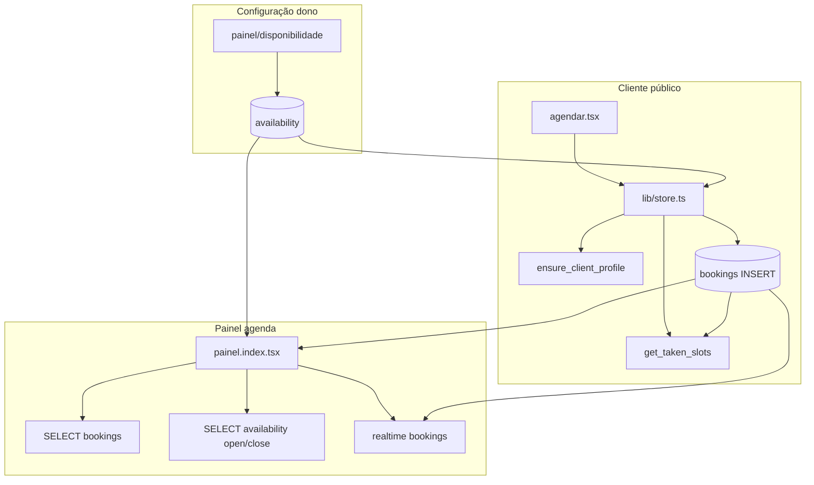

# Arquitetura da agenda — Markee

> O produto tem **duas faces** da agenda: (1) **painel do dono** (`/painel`) — timeline visual; (2) **fluxo do cliente** (`/b/:slug/agendar`) — wizard que escolhe horário.  
> Este documento cobre ambas e como se conectam ao Supabase.

---

## Índice

1. [Mapa mental](#1-mapa-mental)
2. [Arquivos por responsabilidade](#2-arquivos-por-responsabilidade)
3. [Fluxo frontend — painel (agenda)](#3-fluxo-frontend--painel-agenda)
4. [Fluxo frontend — cliente (agendar)](#4-fluxo-frontend--cliente-agendar)
5. [Fluxo backend](#5-fluxo-backend)
6. [Fluxo Supabase](#6-fluxo-supabase)
7. [Realtime](#7-realtime)
8. [Cálculo de horários e disponibilidade](#8-cálculo-de-horários-e-disponibilidade)
9. [Bloqueios](#9-bloqueios)
10. [Profissionais](#10-profissionais)
11. [Timezone](#11-timezone)
12. [Regras de conflito](#12-regras-de-conflito)
13. [Renderização da timeline](#13-renderização-da-timeline)
14. [Hooks e queries](#14-hooks-e-queries)
15. [Gargalos e riscos](#15-gargalos-e-riscos)
16. [Evolução futura](#16-evolução-futura)

---

## 1. Mapa mental



**Não existe** API REST própria nem server function dedicada à agenda. Tudo passa pelo **Supabase client** no browser (RLS + RPCs).

---

## 2. Arquivos por responsabilidade

| Responsabilidade | Arquivo(s) |
|------------------|------------|
| **Timeline do dono** (dia/semana/mês, cards, cancelar) | `src/routes/painel.index.tsx` |
| **Layout + auth do painel** | `src/routes/painel.tsx` |
| **Config horários / dias / almoço / leads** | `src/routes/painel.disponibilidade.index.tsx` |
| **Profissionais + logo** (indireto na agenda) | `src/routes/painel.disponibilidade.mais-ajustes.tsx`, `src/lib/professionals.functions.ts` |
| **Wizard agendamento cliente** | `src/routes/agendar.tsx`, `src/routes/b.$slug.agendar.tsx` |
| **Domínio: slots, booking, availability** | `src/lib/store.ts` |
| **Tenant ID nas queries** | `src/lib/tenant.ts` → `getCurrentTenantId()` |
| **Bloqueio SaaS na UI** | `src/components/AppShell.tsx`, `src/hooks/use-tenant-status.ts` |
| **Dialog cancelar** | `src/components/ConfirmCancelDialog.tsx` |
| **Schema + RPCs + triggers** | `supabase/migrations/*.sql` |
| **Tipos** | `src/integrations/supabase/types.ts` |

**Hooks usados na agenda:**

| Hook | Onde | Papel |
|------|------|-------|
| `useAuth` | `painel.tsx` | Exige login |
| `useTenantStatus` | `AppShell` | Overlay se tenant bloqueado |
| *(nenhum hook de agenda)* | `painel.index.tsx` | Estado local `useState` + `useEffect` |

A agenda **não usa** React Query; só `agendar`/`painel.pagamentos` usam em outras telas.

---

## 3. Fluxo frontend — painel (agenda)

**Rota:** `/painel` → `AgendaPage` em `painel.index.tsx`  
**Pré-requisito:** `painel.tsx` valida sessão + `user_roles.tenant_id === getCurrentTenantId()`.

### 3.1 Montagem

1. Estado: `view` (`dia` | `semana` | `mes`), `cursor` (data âncora), `items` (bookings), `openTime` / `closeTime`.
2. **`load()`** — query bookings no intervalo da visão.
3. **Mount único** — busca `availability.open_time/close_time` para altura da grade.
4. **Realtime** — subscribe `bookings` → chama `load()` de novo.
5. **Render** — grade CSS + `layoutItems()` posiciona cards absolutos.

### 3.2 Navegação temporal

| View | `cursor` | Dias renderizados | Range SQL `load()` |
|------|----------|-------------------|---------------------|
| **dia** | dia escolhido | 1 coluna | `date = cursor` |
| **semana** | 1º dia da semana | 7 colunas | `cursor` … `cursor+6` |
| **mês** | 1º dia visível no mês | min 28 dias até fim do mês | mesmo intervalo |

Funções locais: `buildDays`, `rangeFor`, `move(±1)`, `labelFor`.

### 3.3 Cancelamento

- **Dia:** botão lixeira no card → `ConfirmCancelDialog`.
- **Semana/mês:** clique no card abre o mesmo dialog.
- **`doCancel`:** `UPDATE bookings SET status = 'cancelled' WHERE id = ?` (direto, **não** usa RPC `cancel_booking`).
- Dono não precisa informar WhatsApp (diferente do fluxo cliente).

### 3.4 O que o painel NÃO faz

- Não cria agendamento (só visualiza/cancela).
- Não filtra por profissional (todos os pros na mesma coluna do dia).
- Não usa `blocked_dates`.
- Não recalcula slots disponíveis (isso é só no fluxo `agendar`).

---

## 4. Fluxo frontend — cliente (agendar)

**Rota:** `/b/:slug/agendar` → `AgendarPage` (`agendar.tsx`).

### 4.1 Steps dinâmicos

```text
dados → [profissional?] → servico → data → horario → confirm
```

- Se `availability.require_pro_selection === true`, insere step `profissional`.
- Draft persistido em `localStorage` (`rh_draft` via `getDraft`/`setDraft`).

### 4.2 Carga inicial (`useEffect` mount)

| Dado | Query |
|------|--------|
| Config | `fetchAvailability()` → `availability` por `tenant_id` |
| Serviços | `services` active, `tenant_id`, `sort_order` |
| Profissionais | `professionals` active, `tenant_id`, `sort_order` |
| Realtime | channels em `services` e `professionals` |

### 4.3 Step data

- `DataStep`: desabilita dias passados, `max_future_days`, `days_enabled`, e “hoje sem vaga” (`todayHasRoom` heurística em BRT).
- **Não chama** `getAvailableSlots` no calendário — só no step horário.

### 4.4 Step horário

- `getAvailableSlots({ date, serviceDurationMin, professionalId })`.
- Realtime channel `bookings-realtime` → `reload()` quando qualquer booking muda.
- Usuário escolhe slot → `confirm()` → `createBooking()`.

### 4.5 Confirmação

`createBooking` (store.ts) → ver [§6](#6-fluxo-supabase).

---

## 5. Fluxo backend

No sentido clássico de “backend Node”, a agenda tem **pouco código servidor**:

| Camada | Agenda |
|--------|--------|
| TanStack **server functions** | **Não** usadas na agenda |
| **Supabase Postgres** | Fonte de verdade + RPCs + triggers |
| **SSR** | Páginas são majoritariamente client-side; dados vêm do browser |

Exceções relacionadas:

- `professionals.functions.ts` — CRUD de profissionais (impacta quem aparece no agendar).
- `admin.functions.ts` — não mexe na grade, mas `confirm_payment` / status tenant afetam trigger `bookings_block_when_tenant_blocked`.

**Conclusão:** “backend da agenda” = **Supabase** (RLS, RPCs SECURITY DEFINER, índice único, triggers).

---

## 6. Fluxo Supabase

### 6.1 Tabelas envolvidas

| Tabela | Papel na agenda |
|--------|-----------------|
| `availability` | Grade horária, dias úteis, almoço, leads |
| `bookings` | Eventos na timeline + ocupação de slots |
| `services` | Duração e preço |
| `professionals` | Filtro de conflito opcional |
| `profiles` | Cliente bloqueado (`active`) |
| `tenants` | Bloqueio SaaS no INSERT |
| `blocked_dates` | **Existe no DB, não usada no app** |

### 6.2 RPCs

| RPC | Chamador | Função |
|-----|----------|--------|
| `get_taken_slots(_date, _professional_id?, _tenant_id?)` | `getAvailableSlots` | Lista horários ocupados (sem PII) |
| `ensure_client_profile(...)` | `createBooking` | Cria/acha profile por WhatsApp+tenant |
| `is_client_active(...)` | `agendar` goNext | Bloqueia cliente inativo |
| `cancel_booking` | `meus-agendamentos` | **Não** usado no painel agenda |

SQL efetivo de `get_taken_slots`:

```sql
SELECT b.time, b.duration_min, b.professional_id
FROM bookings b
WHERE b.date = _date
  AND b.tenant_id = _tenant_id
  AND b.status IN ('pending','confirmed')
  AND (_professional_id IS NULL OR b.professional_id = _professional_id);
```

### 6.3 INSERT booking (cliente)

Ordem lógica em `createBooking`:

1. `ensure_client_profile`
2. `SELECT profiles` → se `active = false` → erro `BLOCKED`
3. `SELECT services` + `professionals` (validação)
4. `duration_min = ceil(duration/30)*30`
5. `INSERT bookings` status `confirmed`
6. Triggers BEFORE INSERT:
   - `bookings_ensure_profile` (garante profile)
   - `bookings_block_when_tenant_blocked` (SaaS)
7. Conflito: índice único `bookings_unique_slot` → erro duplicate

### 6.4 SELECT agenda (dono)

```typescript
supabase.from("bookings")
  .select("*")
  .eq("tenant_id", getCurrentTenantId())
  .gte("date", from).lte("date", to)
  .neq("status", "cancelled")
  .order("date").order("time");
```

---

## 7. Realtime

| Canal | Arquivo | Tabela | Filtro WAL | Efeito |
|-------|---------|--------|------------|--------|
| `painel-bookings` | `painel.index.tsx` | `bookings` | **Nenhum** (todos os eventos) | `load()` refetch tenant no JS |
| `services-booking-realtime` | `agendar.tsx` | `services` | global | recarrega serviços |
| `pros-booking-realtime` | `agendar.tsx` | `professionals` | global | recarrega pros |
| `bookings-realtime` | `agendar.tsx` (HorarioStep) | `bookings` | global | `getAvailableSlots` de novo |

**Publicação:** migration adiciona `bookings` em `supabase_realtime` com `REPLICA IDENTITY FULL`.

**Problema:** no painel, qualquer INSERT em **qualquer tenant** dispara `load()` no browser (filtra depois). Em escala multi-tenant isso é ruído de rede.

---

## 8. Cálculo de horários e disponibilidade

### 8.1 Grade base — `generateSlots()` (`store.ts`)

- Intervalo: **30 minutos** entre `open_time` e `close_time`.
- Exclui bloco `[lunch_start, lunch_end)` se `lunch_enabled`.
- Retorno: `string[]` tipo `"08:00"`, `"08:30"`, …

### 8.2 Disponibilidade — `getAvailableSlots()`

Pipeline:

```mermaid
flowchart TD
  A[fetchAvailability] --> B{days_enabled[dow]?}
  B -->|não| Z[retorna []]
  B -->|sim| C[generateSlots]
  C --> D[RPC get_taken_slots]
  D --> E[Marcar slots taken por duração arredondada]
  E --> F{é hoje em America/Sao_Paulo?}
  F -->|sim| G[Aplicar min_lead_min]
  F -->|não| H[Verificar janela cabe no fim do dia]
  G --> I[Lista time + available]
  H --> I
```

Regras por slot `time`:

1. **`slotsNeeded = roundDuration(service) / 30`** — precisa de N blocos consecutivos livres.
2. **Taken:** para cada booking retornado, marca `duration_min` arredondada em passos de 30 min a partir de `time`.
3. **Fim do expediente:** `idx + slotsNeeded > allSlots.length` → indisponível.
4. **Hoje (BRT):** `slotMin - nowMin < min_lead_min` → indisponível.

**Chamadas por seleção de horário:** 1× `fetchAvailability` + 1× RPC `get_taken_slots` (cada `reload`).

### 8.3 Disponibilidade no calendário de datas (`DataStep`)

Regras **só no frontend** (sem RPC):

- `past`, `date > today + max_future_days`, `!days_enabled[weekday]`.
- `todayHasRoom`: compara relógio BRT + `min_lead_min` + 30 min com `close_time` (heurística “ainda cabe algum serviço”).

Não verifica bookings no calendário — dia pode aparecer clicável e step horário vir vazio.

---

## 9. Bloqueios

| Tipo | Implementado | Onde |
|------|--------------|------|
| **Dia da semana off** | ✅ | `availability.days_enabled` + `getAvailableSlots` / `DataStep` |
| **Almoço** | ✅ | `lunch_enabled` + `generateSlots` |
| **Lead mínimo agendar** | ✅ | `min_lead_min` + BRT em `getAvailableSlots` |
| **Lead mínimo cancelar** | ✅ | RPC `cancel_booking` + `availability` do tenant do booking |
| **Cliente inativo** | ✅ | `profiles.active` + `is_client_active` |
| **Tenant SaaS bloqueado** | ✅ | trigger `bookings_block_when_tenant_blocked` + `AppShell` |
| **Datas bloqueadas** (`blocked_dates`) | ❌ **não wired** | Tabela existe, zero uso em `src/` |
| **Bloqueio manual no painel** | ✅ parcial | Cancelar = `status cancelled` |

---

## 10. Profissionais

### 10.1 No agendamento (cliente)

- Lista: `professionals` com `active=true` e `tenant_id`.
- Step opcional conforme `require_pro_selection`.
- **Conflito de horário:** `get_taken_slots` com `_professional_id`:
  - **Com pro:** só bookings daquele profissional ocupam slot.
  - **Sem pro (`NULL`):** **todos** os bookings do tenant no dia ocupam (agenda “compartilhada”).

### 10.2 Na timeline (dono)

- Cards mostram `professional_name` (snapshot no booking).
- **Não há coluna por profissional** — vários pros no mesmo eixo temporal com algoritmo de colunas (`layoutItems`).
- Filtro RLS `pro reads own bookings` existe no DB, mas o painel usa role **owner** → vê tudo do tenant.

### 10.3 CRUD profissionais

`painel.disponibilidade.mais-ajustes.tsx` + server functions `createProfessional` / `update` / `delete` (Auth Admin API).

---

## 11. Timezone

| Contexto | TZ usada | Arquivo |
|----------|----------|---------|
| Lead mínimo / “hoje” nos slots | **`America/Sao_Paulo`** | `store.ts` `getAvailableSlots` |
| Calendário cliente `todayIso` | **`America/Sao_Paulo`** | `agendar.tsx` `DataStep` |
| Cancelamento tardio | **`America/Sao_Paulo`** | RPC `cancel_booking` |
| Label “hoje” no painel | **`America/Sao_Paulo`** | `painel.index.tsx` `todayBR` |
| Linha “agora” na timeline | **Timezone do browser** | `nowOffset` usa `new Date()` local |
| Auto-scroll para agora | **Browser local** | `useEffect` dia view |
| Datas SQL `date` / `time` | **Sem timezone** (date + time without tz) | Postgres |

**Inconsistência:** linha vermelha “agora” no painel pode deslocar ~1h para usuário fora do Brasil. Slots de agendamento assumem BRT.

**`days_enabled`:** `new Date(iso + "T12:00:00")` — meio-dia local do browser para obter `getDay()`, não BRT explícito.

---

## 12. Regras de conflito

### 12.1 Camada aplicação (`getAvailableSlots`)

- Impede escolher slot se qualquer bloco de 30 min na janela `[time, time+duration)` está taken.
- Taken derivado de bookings `pending` + `confirmed` via RPC.

### 12.2 Camada banco

**Índice único parcial:**

```sql
UNIQUE (professional_id, date, time)
WHERE status IN ('pending', 'confirmed')
```

- Impede **mesmo profissional** no **mesmo instante**.
- Em PostgreSQL, **`professional_id IS NULL`** permite **vários** bookings no mesmo `date+time` (NULLs distintos no índice único).
- Dois clientes sem profissional selecionado podem “passar” no índice e só colidir na lógica de slots se `get_taken_slots` sem pro estiver correta.

### 12.3 Race condition

Dois clientes no mesmo slot:

1. Ambos veem slot `available` (realtime ajuda mas não é transacional).
2. Ambos fazem INSERT.
3. Segundo pode falhar com **duplicate** (se mesmo `professional_id`) ou ambos entrarem (se `professional_id` NULL).

Mensagem UX: `"Esse horário acabou de ser reservado."` (`store.ts`).

### 12.4 Duração vs slot de início

Conflito usa **início** no índice único, mas ocupação na grade usa **duração arredondada** (ex.: serviço 45 min → 60 min = 2 blocos). Booking às 09:00 com 60 min bloqueia 09:00 e 09:30.

---

## 13. Renderização da timeline

**Arquivo único:** `painel.index.tsx`.

### 13.1 Constantes de layout

| Constante | Valor | Significado |
|-----------|-------|-------------|
| `HOUR_PX` | 160 | Altura de 1 hora na grade |
| `MIN_CARD_PX` | 72 | Altura mínima do card |
| `TIME_COL_PX` | 56 | Coluna de rótulos de hora |
| `DAY_COL_MIN_PX` | 140 | Largura mínima coluna (referência) |
| `MONTH_VISIBLE_DAYS` | 14 | Alvo de colunas visíveis no mês |

Altura total: `(closeMin - openMin) / 60 * HOUR_PX + 24`.

### 13.2 Estrutura DOM

```text
grid [time col | body]
  header dias (translateX sincronizado com scroll)
  body scroll-x (semana/mês)
    grid N colunas (1 por dia)
      linhas horizontais (hora + meia hora tracejada)
      linha "agora" (se dia = todayBR)
      cards position:absolute (top/height/left/width %)
```

### 13.3 Algoritmo `layoutItems()` — overlap estilo calendário

1. Converte cada booking em `[startMin, endMin)` a partir de `time` + `duration_min` (mín 20 min).
2. Filtra fora da janela `openMin..closeMin`.
3. Ordena por `start`, depois `end`.
4. **Clustering:** bookings que se sobrepõem no tempo compartilham colunas:
   - Atribui coluna `0..n-1` greedy (primeira coluna livre).
   - `cols` = largura do cluster para dividir largura (`widthPct = 100/cols`).
5. Posição vertical: `top = ((start - openMin) / 60) * HOUR_PX + 12`.
6. Altura: `(dur / 60) * HOUR_PX - 4`, mínimo `MIN_CARD_PX`.

**Limitação:** overlap só dentro do **mesmo dia/coluna**; não há eixo separado por profissional.

### 13.4 Responsividade

- `ResizeObserver` em `bodyScrollRef` → `containerW` → `colPx`.
- Scroll horizontal sincronizado (`topScrollRef` ↔ `bodyScrollRef`).
- Modo **dia:** uma coluna = largura total; **semana:** 7 colunas; **mês:** até 28+ colunas com scroll.

---

## 14. Hooks e queries

### 14.1 Painel agenda — queries Supabase

| # | Operação | Quando |
|---|----------|--------|
| 1 | `bookings.select(*).eq(tenant_id).gte/lte date` | `load()`, view/cursor change, realtime |
| 2 | `availability.select(open_time, close_time).eq(tenant_id)` | mount 1× |
| 3 | `bookings.update({status:'cancelled'}).eq(id)` | cancelar |

### 14.2 Cliente agendar — queries

| # | Operação | Quando |
|---|----------|--------|
| 1 | `availability` via `fetchAvailability` | mount |
| 2 | `services.select` active | mount + realtime |
| 3 | `professionals.select` active | mount + realtime |
| 4 | `rpc('is_client_active')` | avançar steps com WhatsApp |
| 5 | `rpc('get_taken_slots')` | step horário + realtime bookings |
| 6 | `rpc('ensure_client_profile')` | confirm |
| 7 | `profiles.select` | após ensure |
| 8 | `services` / `professionals` select | confirm validação |
| 9 | `bookings.insert` | confirm |

### 14.3 Disponibilidade (dono)

| # | Operação | Quando |
|---|----------|--------|
| 1 | `fetchAvailability` | mount |
| 2 | `availability.update(...).eq(tenant_id)` | salvar |

---

## 15. Gargalos e riscos

### 15.1 Performance

| Gargalo | Severidade | Detalhe |
|---------|------------|---------|
| **Realtime sem filtro tenant** | Alta (multi-tenant) | Todo evento global em `bookings` refetch no painel |
| **`fetchAvailability` em cada `getAvailableSlots`** | Média | N+1 rede; poderia cachear por sessão |
| **Mês: 28+ colunas DOM** | Média | Centenas de células + todos os cards no range |
| **`layoutItems` O(n²) clusters** | Baixa/média | n = bookings do dia; ok até ~50, pesado em 200+ |
| **Sem paginação** | Média | `load()` traz todos os bookings do intervalo |
| **Realtime + RPC em HorarioStep** | Média | Cada mudança global dispara RPC + availability fetch |

### 15.2 Correção / produto

| Risco | Detalhe |
|-------|---------|
| `blocked_dates` morto | Dono não bloqueia feriado no app |
| Calendário sem checagem de ocupação | Dia habilitado mas sem slots |
| TZ mista painel | Linha “agora” vs BRT nos slots |
| Índice único + `professional_id` NULL | Duplo agendamento mesmo horário possível |
| Painel cancel sem RPC | Ignora `cancel_min_lead` do cliente (dono cancela sempre) |
| Agenda sem coluna por pro | Escala mal com muitos profissionais |

### 15.3 Segurança (agenda)

- Cliente agenda com anon key + RLS `anyone creates booking`.
- Mitigação: triggers, unique index, `get_taken_slots` tenant-scoped quando app passa `_tenant_id`.

---

## 16. Evolução futura

### 16.1 Agenda estilo Google Calendar

| Hoje | Alvo |
|------|------|
| Estado local, sem biblioteca | [@schedule-x/calendar](https://schedule-x.dev/), FullCalendar, ou `@toast-ui/calendar` |
| 1 eixo por dia | Recurso = profissional (coluna ou lane) |
| Sem drag | Event model imutável + mutation API |

**Arquitetura sugerida:**

1. **Modelo de evento** normalizado: `{ id, start, end, resourceId, title, meta }` derivado de `bookings`.
2. **Camada de dados** única: React Query `useBookings(range, tenantId, professionalIds?)`.
3. **Config** central: `useAvailability(tenantId)` compartilhado painel + agendar.
4. Substituir `layoutItems` pela lib ou manter para TV mode leve.

**Arquivos a criar/refatorar:**

- `src/lib/calendar/` — adapters booking ↔ event
- `src/routes/painel.index.tsx` — shell fino + `<CalendarView />`
- Opcional RPC `get_calendar_events(from, to, tenant_id)` — 1 round-trip, menos payload

### 16.2 Drag and drop

Pré-requisitos:

1. **PATCH booking** com validação server-side (RPC `move_booking`):
   - Revalida `get_taken_slots` / conflito dentro da transação.
   - Respeita `min_lead`, tenant blocked, duração.
2. **Optimistic UI** + rollback se 409.
3. Realtime continua como source of truth.

```sql
-- Exemplo futuro
move_booking(_id, _new_date, _new_time, _new_professional_id)
```

Painel hoje só `update status`; mover horário **não existe**.

### 16.3 TV mode

- Rota `/painel/tv` ou query `?tv=1`.
- View fixa **dia**, auto-refresh 30–60s (ou realtime filtrado).
- Tipografia grande, sem interação cancel (read-only).
- **Virtualização opcional** se muitos eventos — ver abaixo.
- Fullscreen API + `prefers-reduced-motion` off para scroll suave.

### 16.4 Virtualização

Problema atual: mês renderiza 28+ colunas × ~24 linhas horárias + todos os cards.

Soluções:

| Abordagem | Uso |
|-----------|-----|
| `@tanstack/react-virtual` | Virtualizar **eixo horizontal** (dias) ou lista de cards |
| Window de datas | Carregar só `visibleStart..visibleEnd` (+ buffer 3 dias) |
| Canvas/WebGL | Só se >500 eventos visíveis (overkill hoje) |

Manter `HOUR_PX` fixo; virtualizar colunas em semana/mês.

### 16.5 Múltiplos profissionais simultâneos

**Modelo recomendado:** **resource timeline** (Google Calendar “calendar per resource”).

```text
         │ Ronielson │ Lucas │ Maria │
09:00    │ [card A]  │       │       │
09:30    │           │ [ B ] │       │
```

Implementação:

1. `load({ professionalIds: string[] | 'all' })` ou 1 query com coluna `professional_id`.
2. Header com toggle de pros ativos.
3. `layoutItems` **por coluna de prof** (substitui overlap global) ou deixar a lib fazer.
4. `get_taken_slots` sempre com `_professional_id` definido no agendar.
5. Corrigir índice único: considerar `UNIQUE (tenant_id, professional_id, date, time)` ou partial sem NULL.

**Backend:** view materializada ou RPC `get_agenda_grid(tenant, from, to)` retornando JSON por pro.

### 16.6 Realtime melhorado

```typescript
supabase.channel(`tenant-${tenantId}-bookings`)
  .on('postgres_changes', {
    event: '*',
    schema: 'public',
    table: 'bookings',
    filter: `tenant_id=eq.${tenantId}`,
  }, handler)
```

Reduz refetch cross-tenant (requer replicação com filtro no projeto Supabase).

### 16.7 `blocked_dates`

1. UI em `painel/disponibilidade` — mini calendário de bloqueio.
2. `getAvailableSlots` → se `date in blocked_dates` return `[]`.
3. Índice `UNIQUE (tenant_id, date)` (substituir unique global legado).

---

## Referência rápida

| Pergunta | Resposta |
|----------|----------|
| Onde está a timeline? | `src/routes/painel.index.tsx` |
| Onde calculam slots? | `src/lib/store.ts` → `getAvailableSlots` |
| Qual RPC de ocupação? | `get_taken_slots` |
| Onde configuram horário? | `painel.disponibilidade.index.tsx` → `availability` |
| Realtime painel? | channel `painel-bookings` |
| Profissional afeta conflito? | Sim, se `_professional_id` passado na RPC |
| Feriados bloqueados? | Tabela existe, **app não usa** |

---

*Documento alinhado ao código em `origin/main`. Ver também `docs/SUPABASE-BANCO.md` e `docs/ESTRUTURA-PROJETO.md`.*
