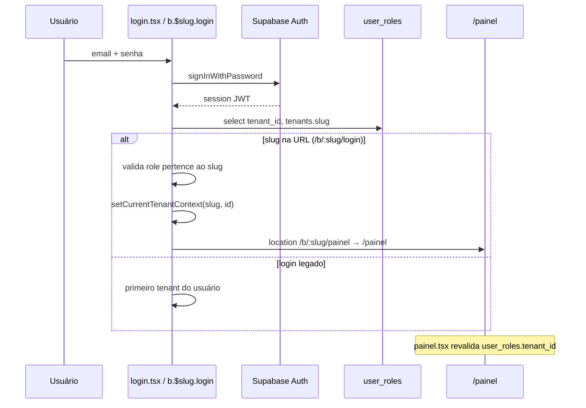
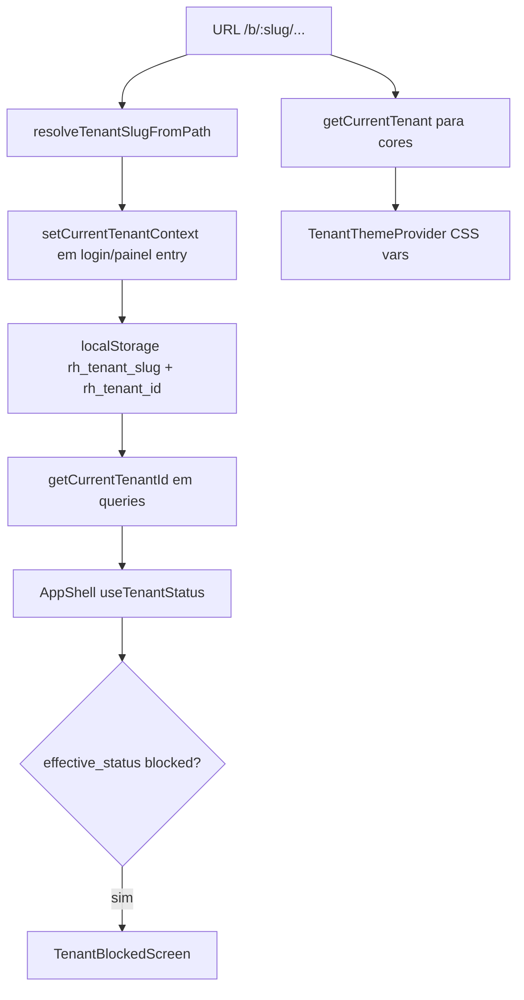

# Estrutura real do projeto Markee (markee-barbearia)

> Documentação gerada a partir do código em `origin/main`. Use junto com `docs/TECNICO-PLATAFORMA.md` (cookbook operacional).  
> **Stack:** React 19 · TanStack Start/Router · React Query · Supabase · Tailwind v4 · Cloudflare/Lovable.

---

## Índice

1. [Árvore `src/`](#1-árvore-src)
2. [Camadas da aplicação](#2-camadas-da-aplicação)
3. [Rotas (TanStack Router)](#3-rotas-tanstack-router)
4. [Componentes principais](#4-componentes-principais)
5. [Hooks](#5-hooks)
6. [Server functions](#6-server-functions)
7. [Store / domínio (`lib/store.ts`)](#7-store--domínio-libstorets)
8. [Integrações Supabase](#8-integrações-supabase)
9. [Providers e contexto](#9-providers-e-contexto)
10. [Middleware](#10-middleware)
11. [Supabase: banco, RPCs, RLS](#11-supabase-banco-rpcs-rls)
12. [Storage buckets](#12-storage-buckets)
13. [Arquivos críticos e sensíveis](#13-arquivos-críticos-e-sensíveis)
14. [Acoplamento alto](#14-acoplamento-alto)
15. [Fluxos completos](#15-fluxos-completos)

---

## 1. Árvore `src/`

```
src/
├── assets/
│   ├── hero-bg.jpg
│   ├── pro-1.jpg
│   └── pro-2.jpg
├── components/
│   ├── AdminShell.tsx              # Layout BackOffice Markee
│   ├── AppShell.tsx                # Layout público/painel + bloqueio tenant
│   ├── ConfirmCancelDialog.tsx
│   ├── MaintenanceDialog.tsx
│   ├── PrimaryButton.tsx
│   ├── ServiceForm.tsx             # CRUD serviço + upload foto
│   ├── TenantBlockedScreen.tsx     # Overlay inadimplência
│   ├── TenantThemeProvider.tsx     # CSS vars por tenant
│   └── ui/                         # shadcn/Radix (40+ primitivos)
├── hooks/
│   ├── use-auth.ts
│   ├── use-mobile.tsx
│   └── use-tenant-status.ts
├── integrations/
│   └── supabase/
│       ├── auth-attacher.ts        # Client: Bearer em serverFn
│       ├── auth-middleware.ts      # Server: valida JWT
│       ├── client.ts               # Browser + SSR (anon key)
│       ├── client.server.ts        # Service role (só servidor)
│       └── types.ts                # Tipos gerados do Postgres
├── lib/
│   ├── admin.functions.ts          # ServerFns BackOffice
│   ├── professionals.functions.ts  # ServerFns CRUD profissionais
│   ├── store.ts                    # Domínio agendamento (não é Zustand)
│   ├── tenant.ts                   # Slug, IDs, branding, tenantHref
│   ├── csv.ts
│   ├── error-capture.ts
│   ├── error-page.ts
│   └── utils.ts                    # cn() Tailwind
├── routes/                         # File-based routing (ver §3)
├── router.tsx                      # createRouter + QueryClient
├── routeTree.gen.ts                # ⚠️ GERADO — não editar
├── server.ts                       # Entry Cloudflare/worker
├── start.ts                        # TanStack Start + middlewares globais
└── styles.css                      # Tema global + classes utilitárias
```

**Fora de `src/` relevante:** `supabase/migrations/`, `supabase/config.toml`, `docs/`.

**Não existem pastas** `services/`, `contexts/`, `stores/` (Zustand/Redux). A camada de serviço é `src/lib/*` + queries diretas nas rotas.

---

## 2. Camadas da aplicação

| Camada | Onde | Responsabilidade |
|--------|------|------------------|
| **Rotas/UI** | `src/routes/*.tsx` | Páginas, formulários, Supabase client-side |
| **Layouts** | `AppShell`, `AdminShell`, `painel.tsx`, `admin.tsx` | Guard visual, menu, bloqueio |
| **Domínio** | `src/lib/store.ts`, `src/lib/tenant.ts` | Slots, booking, draft, tenant |
| **Server** | `src/lib/*.functions.ts` | Operações privilegiadas (admin, Auth Admin API) |
| **Dados** | Supabase Postgres + Storage + Realtime | Fonte única de verdade |
| **Auth** | Supabase Auth + `user_roles` | Sessão JWT, papéis |

---

## 3. Rotas (TanStack Router)

Arquivo gerado: `src/routeTree.gen.ts` (atualizado pelo plugin Vite).

### 3.1 Mapa completo

| URL | Arquivo | Shell | Auth |
|-----|---------|-------|------|
| `/` | `routes/index.tsx` | — | Redirect → `/b/dom-amorim` |
| `/login` | `routes/login.tsx` | AppShell | Redirect → `/b/dom-amorim/login` |
| `/agendar` | `routes/agendar.tsx` | AppShell | Redirect → `/b/dom-amorim/agendar` |
| `/meus-agendamentos` | `routes/meus-agendamentos.tsx` | AppShell | Público (WhatsApp) |
| `/agendamento-confirmado` | `routes/agendamento-confirmado.tsx` | AppShell | Público |
| `/b/:slug/` | `routes/b.$slug.index.tsx` | AppShell | Reexporta `Index` |
| `/b/:slug/agendar` | `routes/b.$slug.agendar.tsx` | AppShell | Reexporta `AgendarPage` |
| `/b/:slug/login` | `routes/b.$slug.login.tsx` | AppShell | Login tenant-aware |
| `/b/:slug/painel` | `routes/b.$slug.painel.tsx` | — | Ativa tenant → `/painel` |
| `/b/:slug/meus-agendamentos` | `routes/b.$slug.meus-agendamentos.tsx` | AppShell | Reexport |
| `/b/:slug/agendamento-confirmado` | `routes/b.$slug.agendamento-confirmado.tsx` | AppShell | Reexport |
| `/painel` | `routes/painel.index.tsx` | `painel.tsx` | Owner/pro + tenant |
| `/painel/clientes` | `routes/painel.clientes.tsx` | idem | idem |
| `/painel/servicos` | `routes/painel.servicos.index.tsx` | idem | idem |
| `/painel/servicos/novo` | `routes/painel.servicos.novo.tsx` | idem | idem |
| `/painel/servicos/$id` | `routes/painel.servicos.$id.tsx` | idem | idem |
| `/painel/disponibilidade` | `routes/painel.disponibilidade.index.tsx` | idem | idem |
| `/painel/disponibilidade/mais-ajustes` | `routes/painel.disponibilidade.mais-ajustes.tsx` | idem | idem |
| `/painel/avaliacoes` | `routes/painel.avaliacoes.tsx` | idem | idem |
| `/painel/recorrencia` | `routes/painel.recorrencia.tsx` | idem | idem |
| `/painel/pagamentos` | `routes/painel.pagamentos.tsx` | idem | idem (**sem link no menu**) |
| `/admin` | `routes/admin.index.tsx` | `admin.tsx` | `admin` role |
| `/admin/login` | `routes/admin.login.tsx` | — | Login admin |
| `/admin/empresas` | `routes/admin.empresas.index.tsx` | AdminShell | admin |
| `/admin/empresas/nova` | `routes/admin.empresas.nova.tsx` | idem | admin |
| `/admin/empresas/$id` | `routes/admin.empresas.$id.tsx` | idem | admin |
| `/admin/pagamentos` | `routes/admin.pagamentos.tsx` | idem | admin |
| `/admin/auditoria` | `routes/admin.auditoria.tsx` | idem | admin |

### 3.2 Layouts de rota

| Arquivo | Função |
|---------|--------|
| `routes/__root.tsx` | `QueryClientProvider`, `TenantThemeProvider`, Toaster, meta HTML |
| `routes/painel.tsx` | Menu lateral, `useAuth`, guard `user_roles.tenant_id`, `AppShell` |
| `routes/painel.servicos.tsx` | Outlet serviços |
| `routes/painel.disponibilidade.tsx` | Outlet disponibilidade |
| `routes/admin.tsx` | Guard `adminWhoami`, redireciona login, `AdminShell` |

### 3.3 Entrada da app

| Arquivo | Função |
|---------|--------|
| `router.tsx` | Instancia router + `queryClient` no context |
| `start.ts` | `functionMiddleware: [attachSupabaseAuth]`, `requestMiddleware: [errorMiddleware]` |
| `server.ts` | Wrapper Cloudflare + página de erro SSR |

---

## 4. Componentes principais

### 4.1 Negócio (não-UI)

| Componente | Arquivo | Uso |
|------------|---------|-----|
| **AppShell** | `components/AppShell.tsx` | Fundo, overlay, `useTenantStatus` → bloqueio |
| **AdminShell** | `components/AdminShell.tsx` | Nav BackOffice (`/admin/*`) |
| **TenantThemeProvider** | `components/TenantThemeProvider.tsx` | Injeta `--primary`, etc. via `getCurrentTenant()` |
| **TenantBlockedScreen** | `components/TenantBlockedScreen.tsx` | Modal bloqueio SaaS |
| **ServiceForm** | `components/ServiceForm.tsx` | Form serviço + `service-photos` bucket |
| **ConfirmCancelDialog** | `components/ConfirmCancelDialog.tsx` | Agenda: cancelar booking |
| **MaintenanceDialog** | `components/MaintenanceDialog.tsx` | Cliente bloqueado na home/agendar |
| **PrimaryButton** | `components/PrimaryButton.tsx` | Botão CTA padrão |

### 4.2 UI (`components/ui/`)

Biblioteca **shadcn/Radix** (botões, dialog, sheet, calendar, form, etc.). Usada pelas rotas; **não contém regra de negócio**. Alterar com cuidado apenas se afetar acessibilidade/estilo global.

---

## 5. Hooks

| Hook | Arquivo | Retorno / comportamento |
|------|---------|-------------------------|
| **useAuth** | `hooks/use-auth.ts` | `{ user, session, loading }` via `onAuthStateChange` |
| **useUserRole** | `hooks/use-auth.ts` | `owner \| professional \| client \| null` de `user_roles` |
| **signOut** | `hooks/use-auth.ts` | `supabase.auth.signOut()` |
| **useTenantStatus** | `hooks/use-tenant-status.ts` | RPC `tenant_public_status`, poll 60s, `blocked` |
| **useIsMobile** | `hooks/use-mobile.tsx` | Breakpoint mobile (UI) |

---

## 6. Server functions

Todas usam `@tanstack/react-start` → `createServerFn`. O browser envia JWT via `attachSupabaseAuth` (`start.ts`).

### 6.1 `src/lib/admin.functions.ts`

Todas com `.middleware([requireSupabaseAuth])` + `assertAdmin()` → RPC `is_admin`. Dados via **`supabaseAdmin`** (bypass RLS).

| Export | Método | Função |
|--------|--------|--------|
| `adminDashboard` | GET | KPIs, gráficos 6 meses |
| `adminListTenants` | GET | Lista empresas + métricas |
| `adminGetTenant` | GET | Detalhe + payments + audit |
| `adminUpdateTenant` | POST | Patch tenant + email owner (GoTrue Admin API) |
| `adminConfirmPayment` | POST | RPC `confirm_payment` |
| `adminSetTenantStatus` | POST | `tenants.status` manual |
| `adminCreateTenant` | POST | Tenant + availability + Auth user owner |
| `adminResetTenantOwnerPassword` | POST | Reset senha owner |
| `adminListPayments` | GET | Histórico pagamentos |
| `adminListAudit` | GET | `audit_logs` |
| `adminWhoami` | GET | `{ isAdmin }` — guard layout admin |
| `tenantSubscription` | GET | Status assinatura para `/painel/pagamentos` |

### 6.2 `src/lib/professionals.functions.ts`

| Export | Método | Função |
|--------|--------|--------|
| `createProfessional` | POST | `auth.admin.createUser` + `professionals` + `user_roles` |
| `updateProfessional` | POST | Atualiza pro + opcional senha |
| `deleteProfessional` | POST | Remove pro + role |

Usado em: `painel.disponibilidade.mais-ajustes.tsx`.

---

## 7. Store / domínio (`lib/store.ts`)

**Não é global state React.** É módulo de funções + tipos + `localStorage`:

| Export | Tipo | Descrição |
|--------|------|-----------|
| Tipos | `Service`, `Professional`, `Booking`, `Availability` | Espelham tabelas |
| `getDraft` / `setDraft` / `clearDraft` | localStorage `rh_draft` | Wizard agendar |
| `rememberMyWhatsapp` / `getMyWhatsapp` | localStorage `rh_my_whatsapp` | Meus agendamentos |
| `maskPhone`, `normalizePhone`, `isValidPhone` | util | BR 11 dígitos |
| `fetchAvailability` | async | `availability` por `tenant_id` |
| `generateSlots` | sync | Grade 30 min |
| `getAvailableSlots` | async | RPC `get_taken_slots` + regras |
| `createBooking` | async | `ensure_client_profile` + `bookings.insert` |
| `cancelBooking` | async | RPC `cancel_booking` |
| `isClientActive` | async | RPC `is_client_active` |

---

## 8. Integrações Supabase

| Arquivo | Ambiente | Chave | Uso |
|---------|----------|-------|-----|
| `client.ts` | Browser + SSR render | `VITE_*` / anon | Queries com RLS, Auth session |
| `client.server.ts` | **Somente servidor** | `SUPABASE_SERVICE_ROLE_KEY` | Admin, criar users |
| `types.ts` | Tipos TS | Gerado | Contrato DB |
| `auth-middleware.ts` | ServerFn | Bearer JWT | `context.userId`, `context.supabase` |
| `auth-attacher.ts` | Browser → ServerFn | Session token | Header Authorization |

**Variáveis:**

- Client: `VITE_SUPABASE_URL`, `VITE_SUPABASE_PUBLISHABLE_KEY`
- Server: `SUPABASE_URL`, `SUPABASE_PUBLISHABLE_KEY`, `SUPABASE_SERVICE_ROLE_KEY`

---

## 9. Providers e contexto

| Provider | Arquivo | Escopo |
|----------|---------|--------|
| **QueryClientProvider** | `routes/__root.tsx` | React Query global |
| **TenantThemeProvider** | `components/TenantThemeProvider.tsx` | CSS variables por slug |
| **Toaster (sonner)** | `__root.tsx` | Notificações |

**Não há** `React.createContext` de domínio (tenant/auth). Estado de tenant = **URL + localStorage** (`tenant.ts`). Auth = **hook `useAuth`**.

**Router context:** `{ queryClient }` em `router.tsx`.

---

## 10. Middleware

| Middleware | Arquivo | Tipo | Efeito |
|------------|---------|------|--------|
| **attachSupabaseAuth** | `auth-attacher.ts` | `function` (client) | Injeta `Authorization: Bearer` nas serverFn |
| **requireSupabaseAuth** | `auth-middleware.ts` | `function` (server) | Valida JWT, popula `userId` |
| **errorMiddleware** | `start.ts` | `request` (server) | Captura erros SSR → HTML erro |
| **normalizeCatastrophicSsrResponse** | `server.ts` | fetch wrapper | Substitui JSON genérico 500 |

**Guards de rota (não são middleware TanStack Start):**

- `painel.tsx`: sessão + `user_roles` vs `getCurrentTenantId()`
- `admin.tsx`: sessão + `adminWhoami()`
- `b.$slug.login` / `b.$slug.painel`: valida tenant no DB

---

## 11. Supabase: banco, RPCs, RLS

### 11.1 Tabelas (`public`)

| Tabela | `tenant_id` | Papel |
|--------|-------------|-------|
| **tenants** | — | Empresa SaaS (slug, status, due_date, cores, owner_*) |
| **availability** | sim (UNIQUE) | Horários, logo, redes, regras agenda |
| **services** | sim | Catálogo + foto |
| **professionals** | sim | Profissionais (opcional `user_id`) |
| **bookings** | sim | Agendamentos |
| **profiles** | sim | Clientes (whatsapp único por tenant) |
| **user_roles** | sim | `owner`, `professional`, `client`, `admin` |
| **blocked_dates** | sim | Dias bloqueados |
| **reviews** | sim | Avaliações |
| **recurrence_campaigns** | sim | Campanhas recorrência |
| **payments** | sim | Pagamentos assinatura Markee |
| **audit_logs** | opcional | Auditoria BackOffice |

### 11.2 Enums

- `app_role`: `owner` | `professional` | `client` | `admin`
- `booking_status`: `pending` | `confirmed` | `cancelled` | `done`
- `campaign_channel`: `whatsapp` | `email`
- `plan_tier`: `basic` | `intermediate` | `premium`

### 11.3 RPCs principais

| RPC | Chamada de |
|-----|------------|
| `get_taken_slots` | `store.getAvailableSlots` |
| `ensure_client_profile` | `store.createBooking` |
| `is_client_active` | `store.isClientActive`, agendar |
| `cancel_booking` | `store.cancelBooking`, meus-agendamentos |
| `get_bookings_by_whatsapp` | meus-agendamentos |
| `get_booking_by_id` | agendamento-confirmado |
| `confirm_payment` | `adminConfirmPayment` |
| `tenant_public_status` | `useTenantStatus` |
| `tenant_effective_status` | DB / refresh status |
| `is_admin` | admin guard, admin.functions |
| `has_role` / `user_belongs_to_tenant` | RLS policies |
| `refresh_all_tenant_statuses` | admin dashboard |

### 11.4 Migrations (ordem cronológica)

Pasta: `supabase/migrations/`. Principais marcos:

| Arquivo (prefixo) | Conteúdo |
|-------------------|----------|
| `20260513141620_*` | Schema inicial (bookings, services, profiles, RLS base) |
| `20260516210813_*` | Bucket `service-photos` |
| `20260520230724_*` | **Multi-tenant:** `tenants`, `tenant_id`, RPCs tenant-aware |
| `20260520233251_*` | Seed Studio Nails (segundo tenant) |
| `20260522231140_*` | **SaaS:** `payments`, `audit_logs`, `confirm_payment`, status |
| `20260522231213_*` | Ajustes RLS pagamentos |
| `20260522232803_*` | `tenant_public_status` |

**Regra:** nunca reordenar/apagar migration aplicada em produção.

### 11.5 Tenant no código vs banco

- **Banco:** fonte de empresas criadas pelo admin (`tenants`).
- **Código:** mapa estático `TENANTS` em `lib/tenant.ts` (cores fallback Dom Amorim / Studio Nails).
- **Runtime:** `rh_tenant_slug` + `rh_tenant_id` no `localStorage`; slug da URL `/b/:slug` tem prioridade.

`TenantThemeProvider` hoje usa **`getCurrentTenant()`** (mapa), não lê `primary_color` do DB automaticamente.

---

## 12. Storage buckets

| Bucket | Público | Uso no código | Path típico |
|--------|---------|---------------|-------------|
| **service-photos** | sim (read) | Logo (`availability.logo_url`), foto serviço, foto profissional | `{tenant_id}/logo-*`, `{tenant_id}/services/*`, `{tenant_id}/pros/*` |

**Arquivos que fazem upload:**

- `components/ServiceForm.tsx`
- `routes/painel.disponibilidade.mais-ajustes.tsx`

**RLS:** policies em `storage.objects` — insert/update/delete exigem role `owner` (migrations `20260516210813`, `20260516213252`).

---

## 13. Arquivos críticos e sensíveis

### 13.1 Mais críticos (quebram o sistema inteiro)

| Arquivo | Por quê |
|---------|---------|
| `src/lib/store.ts` | Todo fluxo de agendamento e slots |
| `src/lib/tenant.ts` | Resolução de `tenant_id` em queries |
| `src/integrations/supabase/client.ts` | Único client browser |
| `src/integrations/supabase/client.server.ts` | Service role — vazamento = comprometimento total |
| `src/lib/admin.functions.ts` | Cria empresa, confirma pagamento, Auth admin |
| `src/routes/painel.tsx` | Guard multi-tenant do painel |
| `src/components/AppShell.tsx` | Bloqueio SaaS global |
| `supabase/migrations/*.sql` | Schema + RLS irreversível em prod |
| `src/start.ts` | Sem `attachSupabaseAuth`, admin/pagamentos quebram |

### 13.2 Sensíveis — alterar só com plano

| Arquivo | Risco |
|---------|-------|
| `src/routeTree.gen.ts` | Sobrescrito pelo build; editar manual = perda |
| `src/integrations/supabase/auth-middleware.ts` | Marcado gerado; muda contrato de todas serverFn |
| `src/integrations/supabase/types.ts` | Dessincronia com DB |
| `src/lib/professionals.functions.ts` | Cria/deleta usuários Auth |
| `src/routes/agendar.tsx` | Wizard grande, muitas dependências |
| `src/routes/painel.index.tsx` | Agenda + realtime |
| `src/styles.css` | Tema global de todas as telas |

### 13.3 NÃO alterar sem cuidado extremo

- **`supabase/migrations/`** em produção Lovable
- **`client.server.ts`** exposto no bundle client (verificar imports!)
- **RPCs `confirm_payment`, `ensure_client_profile`** — lógica financeira/dados
- **Mapa `TENANTS`** — IDs fixos devem bater com seeds (`00000000-...-001`, `...-002`)
- **`routeTree.gen.ts`**, **`auth-attacher.ts`** (comentário: obrigatório em `start.ts`)

### 13.4 Seguros para features isoladas

- Nova rota em `src/routes/` (+ regen automático do route tree)
- Novo item de menu em `painel.tsx` (ex.: link Pagamentos)
- Componentes UI em `components/ui/`
- `docs/*`
- Botão/UX em `login.tsx` sem mudar validação de roles

---

## 14. Acoplamento alto

| Área | Acoplamento | Detalhe |
|------|-------------|---------|
| **Tenant ID** | 🔴 Alto | `getCurrentTenantId()` em store, painel, agendar, ServiceForm — esquecer filtro = vazamento entre empresas |
| **store.ts ↔ agendar.tsx** | 🔴 Alto | Steps, draft, slots, `createBooking` no mesmo fluxo |
| **tenant.ts ↔ TenantThemeProvider** | 🟠 Médio | Branding estático; DB `tenants.primary_color` pouco usado na UI |
| **painel.tsx ↔ user_roles** | 🔴 Alto | Logout forçado se tenant errado |
| **admin.functions ↔ todas rotas admin** | 🔴 Alto | Única API server para BackOffice |
| **RLS ↔ roles** | 🔴 Alto | Mudar policy sem testar owner/client/admin |
| **Realtime ↔ load()** | 🟠 Médio | Várias páginas duplicam padrão channel + reload |
| **Legado `/` vs `/b/:slug`** | 🟠 Médio | Redirects e `tenantHref()` precisam coexistir |

---

## 15. Fluxos completos

### 15.1 Autenticação



**Admin (fluxo separado):**

1. `/admin/login` → `signInWithPassword`
2. RPC `is_admin(user_id)` — senão logout
3. Layout `admin.tsx` chama serverFn `adminWhoami` (mesma checagem server-side)
4. ServerFns usam `requireSupabaseAuth` + `assertAdmin`

**Tokens:** persistidos no `localStorage` pelo Supabase client. ServerFns: `attachSupabaseAuth` → `requireSupabaseAuth`.

---

### 15.2 Tenant



**Ordem de resolução do slug (`getCurrentTenantSlug`):**

1. Path `/b/:slug`
2. `localStorage.rh_tenant_slug` (se existe no mapa `TENANTS`)
3. Default `dom-amorim`

**Entrada painel:** `/b/:slug/painel` busca `tenants` no DB, grava contexto, valida `user_roles`, navega para `/painel`.

---

### 15.3 Agenda (painel do dono)

**Rota:** `/painel` → `painel.index.tsx`

1. **Auth:** `painel.tsx` exige `user` e `user_roles.tenant_id === getCurrentTenantId()`
2. **Load:** `bookings` filtrado por `tenant_id`, intervalo dia/semana/mês, `status != cancelled`
3. **Horário visual:** `availability.open_time/close_time` do tenant
4. **Realtime:** channel `painel-bookings` → `postgres_changes` em `bookings` → `load()`
5. **Cancelar:** update direto `bookings.status = cancelled` (não usa RPC `cancel_booking` — diferente do fluxo cliente)

Views: `dia` | `semana` | `mes` — grade CSS com altura por hora (`HOUR_PX`).

---

### 15.4 Agendamento (cliente)

**Rota:** `/b/:slug/agendar` → `AgendarPage` em `agendar.tsx`

```mermaid
flowchart LR
  S1[dados WhatsApp/nome] --> S2{require_pro?}
  S2 -->|sim| S3[profissional]
  S2 -->|não| S4[serviço]
  S3 --> S4
  S4 --> S5[data]
  S5 --> S6[horário]
  S6 --> S7[createBooking]
  S7 --> S8[/agendamento-confirmado]
```

**Detalhes:**

1. `fetchAvailability()` — regras de almoço, dias, lead time
2. Carrega `services` + `professionals` ativos (`tenant_id`)
3. **Realtime** em `services` e `professionals` durante o wizard
4. Draft em `localStorage` (`rh_draft`) a cada passo
5. `isClientActive(whatsapp)` antes de avançar — bloqueio `MaintenanceDialog`
6. `getAvailableSlots` → RPC `get_taken_slots` + bloqueio horário passado (TZ `America/Sao_Paulo`)
7. `createBooking()` em `store.ts`:
   - `ensure_client_profile`
   - valida serviço/profissional
   - `bookings.insert` status `confirmed`
   - conflito → mensagem horário reservado
8. Redirect `tenantHref("/agendamento-confirmado")?id=...`

**Meus agendamentos:** WhatsApp → RPC `get_bookings_by_whatsapp` + realtime filtrado.

---

### 15.5 Admin (BackOffice Markee)

```mermaid
flowchart TD
  AL[/admin/login] --> AI[is_admin RPC]
  AI --> AD[/admin dashboard]
  AD --> EN[adminListTenants / adminGetTenant]
  EN --> NC[adminCreateTenant]
  NC --> T[(tenants + availability)]
  NC --> AU[Auth Admin createUser]
  NC --> UR[user_roles owner]
  EN --> CP[adminConfirmPayment]
  CP --> RPC[confirm_payment]
  RPC --> T
```

| Tela | ServerFn / ação |
|------|-----------------|
| Dashboard | `adminDashboard` |
| Empresas lista | `adminListTenants` |
| Nova empresa | `adminCreateTenant` |
| Editar empresa | `adminUpdateTenant` |
| Pagamentos | `adminListPayments`, `adminConfirmPayment` |
| Auditoria | `adminListAudit` |
| Bloquear | `adminSetTenantStatus` |

**Criar empresa (resumo):** insert `tenants` → `availability` vazia → `auth.admin.createUser` (owner) → `profiles` + `user_roles` → `audit_logs`.

---

### 15.6 Realtime

Padrão único: `supabase.channel(...).on('postgres_changes', { schema: 'public', table: '...' }, reload).subscribe()`.

| Canal (nome) | Arquivo | Tabela(s) |
|--------------|---------|-----------|
| `painel-bookings` | `painel.index.tsx` | `bookings` |
| `profiles-realtime` | `painel.clientes.tsx` | `profiles`, `bookings` |
| `services-admin-realtime` | `painel.servicos.index.tsx` | `services` |
| `services-booking-realtime` | `agendar.tsx` | `services` |
| `pros-booking-realtime` | `agendar.tsx` | `professionals` |
| `bookings-realtime` | `agendar.tsx` (step horário) | `bookings` |
| `bookings-${whatsapp}` | `meus-agendamentos.tsx` | `bookings` (filtro client) |

**Auth realtime:** `useAuth` usa `supabase.auth.onAuthStateChange` (não Postgres).

**Status tenant:** polling 60s em `useTenantStatus` (não Realtime).

**Cleanup:** `removeChannel` no `useEffect` return (onde implementado).

---

## Referência rápida para IAs

| Tarefa | Começar por |
|--------|-------------|
| Botão ver senha login | `routes/login.tsx` (componente `Field`) |
| Novo menu painel | `routes/painel.tsx` + nova rota em `routes/` |
| Nova empresa | `admin.empresas.nova.tsx` + `adminCreateTenant` |
| Cor da empresa | `lib/tenant.ts` + `TenantThemeProvider.tsx` (+ DB `tenants`) |
| PIX / pagamento | `painel.pagamentos.tsx`, `admin.pagamentos.tsx`, RPC `confirm_payment` |
| Bug agendamento | `lib/store.ts`, `routes/agendar.tsx` |
| Bug tenant errado | `lib/tenant.ts`, `b.$slug.painel.tsx`, `painel.tsx` |
| Schema DB | `integrations/supabase/types.ts`, `supabase/migrations/` |

---

*Última revisão: estrutura do repositório local alinhada a `origin/main`.*
