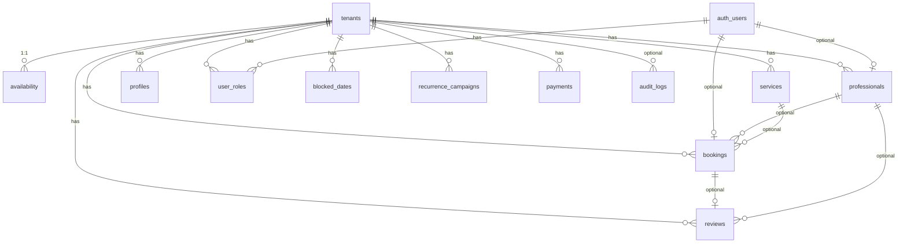

# Banco Supabase — Markee (estado atual do repositório)

> Fonte: `supabase/migrations/*.sql` (21 arquivos) + `src/integrations/supabase/types.ts`.  
> Schema `public` + `storage` + trigger em `auth.users`.  
> **Projeto Supabase (config):** `oaygouigevynbsexxdzw` (`supabase/config.toml`).

---

## Índice

1. [Visão geral](#1-visão-geral)
2. [Enums](#2-enums)
3. [Tabelas (colunas, PK, FK, constraints)](#3-tabelas)
4. [Diagrama de relacionamentos](#4-diagrama-de-relacionamentos)
5. [Índices](#5-índices)
6. [Row Level Security (RLS)](#6-row-level-security-rls)
7. [Triggers](#7-triggers)
8. [Functions / RPCs](#8-functions--rpcs)
9. [Grants (EXECUTE)](#9-grants-execute)
10. [Storage buckets](#10-storage-buckets)
11. [Edge functions](#11-edge-functions)
12. [Views](#12-views)
13. [Realtime](#13-realtime)
14. [Tabelas críticas](#14-tabelas-críticas)
15. [Policies mais sensíveis](#15-policies-mais-sensíveis)
16. [Risco de vazamento multi-tenant](#16-risco-de-vazamento-multi-tenant)
17. [Ordem das migrations](#17-ordem-das-migrations)

---

## 1. Visão geral

| Item | Valor |
|------|--------|
| Schemas documentados | `public`, `storage` (policies), `auth` (1 trigger) |
| Tabelas `public` | **12** |
| Views `public` | **0** (confirmado em `types.ts`) |
| Edge Functions no repo | **0** (sem pasta `supabase/functions/`) |
| Buckets | **1** — `service-photos` |
| Multi-tenant | Coluna `tenant_id` em 9 tabelas + tabela `tenants` |
| Seeds fixos | Dom Amorim `...0001`, Studio Nails `...0002` |

---

## 2. Enums

| Enum | Valores | Uso |
|------|---------|-----|
| `public.app_role` | `owner`, `professional`, `client`, `admin` | `user_roles.role` (`admin` adicionado em migration SaaS) |
| `public.booking_status` | `pending`, `confirmed`, `cancelled`, `done` | `bookings.status` |
| `public.campaign_channel` | `whatsapp`, `email` | `recurrence_campaigns.channel` |
| `public.plan_tier` | `basic`, `intermediate`, `premium` | `recurrence_campaigns.plan_tier` |

**Check constraints (text):**

- `tenants.status` ∈ `active` | `late` | `blocked`
- `reviews.stars` BETWEEN 1 AND 5

---

## 3. Tabelas

Legenda: **PK** = primary key · **NN** = NOT NULL · **DEF** = default.

### 3.1 `public.tenants`

Empresa SaaS (estabelecimento Markee).

| Coluna | Tipo | NN | DEF / notas |
|--------|------|----|-------------|
| `id` | `uuid` | ✓ | `gen_random_uuid()` |
| `slug` | `text` | ✓ | **UNIQUE** |
| `name` | `text` | ✓ | |
| `active` | `boolean` | ✓ | `true` |
| `plan` | `text` | ✓ | `'basic'` |
| `created_at` | `timestamptz` | ✓ | `now()` |
| `status` | `text` | ✓ | `'active'` — CHECK active/late/blocked |
| `due_date` | `date` | | vencimento assinatura |
| `last_payment_at` | `timestamptz` | | |
| `monthly_price` | `numeric` | ✓ | `99` |
| `owner_name` | `text` | | |
| `owner_phone` | `text` | | |
| `owner_email` | `text` | | |
| `blocked_grace_days` | `int` | ✓ | `7` |
| `primary_color` | `text` | | branding |
| `primary_glow_color` | `text` | | |
| `secondary_color` | `text` | | |

**RLS:** habilitado · **FK recebidas:** todas as tabelas com `tenant_id`.

---

### 3.2 `public.availability`

Configuração operacional **1 linha por tenant** (`UNIQUE(tenant_id)`).

| Coluna | Tipo | NN | DEF / notas |
|--------|------|----|-------------|
| `id` | `int` | ✓ | sequência `availability_id_seq` (ex-singleton `id=1` removido) |
| `tenant_id` | `uuid` | ✓ | **FK → tenants(id)** · **UNIQUE** |
| `open_time` | `time` | ✓ | `'08:00'` |
| `close_time` | `time` | ✓ | `'20:00'` |
| `days_enabled` | `boolean[]` | ✓ | dom..sáb |
| `lunch_start` | `time` | | |
| `lunch_end` | `time` | | |
| `lunch_enabled` | `boolean` | ✓ | `false` |
| `min_lead_min` | `int` | ✓ | `30` |
| `min_lead_enabled` | `boolean` | ✓ | `true` |
| `max_future_days` | `int` | ✓ | `60` |
| `require_pro_selection` | `boolean` | ✓ | `true` |
| `cancel_min_lead_enabled` | `boolean` | ✓ | `true` |
| `cancel_min_lead_min` | `int` | ✓ | `60` |
| `business_name` | `text` | | |
| `address` | `text` | | |
| `maps_url` | `text` | | |
| `whatsapp_url` | `text` | | |
| `instagram_url` | `text` | | |
| `facebook_url` | `text` | | |
| `logo_url` | `text` | | URL pública storage |
| `updated_at` | `timestamptz` | ✓ | `now()` |

---

### 3.3 `public.services`

| Coluna | Tipo | NN | DEF |
|--------|------|----|-----|
| `id` | `uuid` | ✓ | `gen_random_uuid()` |
| `tenant_id` | `uuid` | ✓ | FK → `tenants` |
| `name` | `text` | ✓ | |
| `description` | `text` | | |
| `duration_min` | `int` | ✓ | |
| `price` | `numeric(10,2)` | ✓ | `0` |
| `emoji` | `text` | | |
| `photo_url` | `text` | | |
| `active` | `boolean` | ✓ | `true` |
| `sort_order` | `int` | ✓ | `0` |
| `promo_pct` | `int` | | |
| `promo_starts_at` | `timestamptz` | | |
| `promo_ends_at` | `timestamptz` | | |
| `created_at` | `timestamptz` | ✓ | `now()` |

---

### 3.4 `public.professionals`

| Coluna | Tipo | NN | DEF |
|--------|------|----|-----|
| `id` | `uuid` | ✓ | `gen_random_uuid()` |
| `tenant_id` | `uuid` | ✓ | FK → `tenants` |
| `user_id` | `uuid` | | FK → `auth.users(id)` ON DELETE SET NULL |
| `name` | `text` | ✓ | |
| `role` | `text` | | cargo exibido |
| `photo_url` | `text` | | |
| `active` | `boolean` | ✓ | `true` |
| `sort_order` | `int` | ✓ | `0` |
| `created_at` | `timestamptz` | ✓ | `now()` |

---

### 3.5 `public.bookings`

| Coluna | Tipo | NN | DEF |
|--------|------|----|-----|
| `id` | `uuid` | ✓ | `gen_random_uuid()` |
| `tenant_id` | `uuid` | ✓ | FK → `tenants` |
| `client_name` | `text` | ✓ | |
| `client_name_snapshot` | `text` | | nome digitado no formulário |
| `whatsapp` | `text` | ✓ | normalizado |
| `email` | `text` | | |
| `professional_id` | `uuid` | | FK → `professionals` |
| `service_id` | `uuid` | | FK → `services` |
| `service_name` | `text` | ✓ | snapshot |
| `professional_name` | `text` | | snapshot |
| `date` | `date` | ✓ | |
| `time` | `time` | ✓ | |
| `duration_min` | `int` | ✓ | |
| `price` | `numeric(10,2)` | ✓ | `0` |
| `status` | `booking_status` | ✓ | `'confirmed'` |
| `user_id` | `uuid` | | FK → `auth.users` (opcional) |
| `created_at` | `timestamptz` | ✓ | `now()` |

**Replica:** `REPLICA IDENTITY FULL` (realtime).

---

### 3.6 `public.profiles`

Clientes (WhatsApp) **e** espelho de usuários Auth (mesmo `id` quando logado).

| Coluna | Tipo | NN | DEF |
|--------|------|----|-----|
| `id` | `uuid` | ✓ | PK — **sem FK** para `auth.users` (removida) |
| `tenant_id` | `uuid` | ✓ | FK → `tenants` |
| `name` | `text` | | |
| `whatsapp` | `text` | | |
| `email` | `text` | | |
| `active` | `boolean` | ✓ | `true` |
| `created_at` | `timestamptz` | ✓ | `now()` |

---

### 3.7 `public.user_roles`

| Coluna | Tipo | NN | DEF |
|--------|------|----|-----|
| `id` | `uuid` | ✓ | `gen_random_uuid()` |
| `user_id` | `uuid` | ✓ | FK → `auth.users` CASCADE |
| `role` | `app_role` | ✓ | |
| `tenant_id` | `uuid` | ✓ | FK → `tenants` |

**Constraint:** `UNIQUE (user_id, role)` — um usuário só pode ter **uma linha por papel** (ex.: um `owner` no sistema inteiro).

---

### 3.8 `public.blocked_dates`

| Coluna | Tipo | NN | DEF |
|--------|------|----|-----|
| `id` | `uuid` | ✓ | `gen_random_uuid()` |
| `tenant_id` | `uuid` | ✓ | FK → `tenants` |
| `date` | `date` | ✓ | **UNIQUE global** em `date` (legado) |
| `reason` | `text` | | |

---

### 3.9 `public.reviews`

| Coluna | Tipo | NN | DEF |
|--------|------|----|-----|
| `id` | `uuid` | ✓ | `gen_random_uuid()` |
| `tenant_id` | `uuid` | ✓ | FK → `tenants` |
| `booking_id` | `uuid` | | FK → `bookings` CASCADE |
| `professional_id` | `uuid` | | FK → `professionals` |
| `stars` | `int` | ✓ | 1–5 |
| `comment` | `text` | | |
| `created_at` | `timestamptz` | ✓ | `now()` |

---

### 3.10 `public.recurrence_campaigns`

| Coluna | Tipo | NN | DEF |
|--------|------|----|-----|
| `id` | `uuid` | ✓ | `gen_random_uuid()` |
| `tenant_id` | `uuid` | ✓ | FK → `tenants` |
| `name` | `text` | ✓ | |
| `channel` | `campaign_channel` | ✓ | |
| `target_filter` | `text` | ✓ | `'all_active'` |
| `template` | `text` | ✓ | |
| `scheduled_at` | `timestamptz` | | |
| `status` | `text` | ✓ | `'draft'` |
| `plan_tier` | `plan_tier` | ✓ | `'basic'` |
| `created_at` | `timestamptz` | ✓ | `now()` |

---

### 3.11 `public.payments`

Assinatura Markee → estabelecimento.

| Coluna | Tipo | NN | DEF |
|--------|------|----|-----|
| `id` | `uuid` | ✓ | `gen_random_uuid()` |
| `tenant_id` | `uuid` | ✓ | FK → `tenants` ON DELETE CASCADE |
| `amount` | `numeric` | ✓ | |
| `paid_at` | `timestamptz` | ✓ | `now()` |
| `method` | `text` | ✓ | `'manual'` |
| `reference` | `text` | | |
| `provider` | `text` | | |
| `provider_ref` | `text` | | |
| `created_by` | `uuid` | | auth.uid() na RPC |
| `notes` | `text` | | |
| `created_at` | `timestamptz` | ✓ | `now()` |

---

### 3.12 `public.audit_logs`

| Coluna | Tipo | NN | DEF |
|--------|------|----|-----|
| `id` | `uuid` | ✓ | `gen_random_uuid()` |
| `actor_id` | `uuid` | | |
| `actor_email` | `text` | | |
| `tenant_id` | `uuid` | | FK → `tenants` SET NULL |
| `action` | `text` | ✓ | |
| `details` | `jsonb` | ✓ | `'{}'` |
| `created_at` | `timestamptz` | ✓ | `now()` |

---

## 4. Diagrama de relacionamentos



**FK explícitas (Postgres):**

| Tabela | Coluna | Referência | ON DELETE |
|--------|--------|------------|-----------|
| `availability` | `tenant_id` | `tenants(id)` | — |
| `services` | `tenant_id` | `tenants(id)` | — |
| `professionals` | `tenant_id` | `tenants(id)` | — |
| `professionals` | `user_id` | `auth.users(id)` | SET NULL |
| `bookings` | `tenant_id` | `tenants(id)` | — |
| `bookings` | `professional_id` | `professionals(id)` | SET NULL |
| `bookings` | `service_id` | `services(id)` | SET NULL |
| `bookings` | `user_id` | `auth.users(id)` | SET NULL |
| `profiles` | `tenant_id` | `tenants(id)` | — |
| `user_roles` | `user_id` | `auth.users(id)` | CASCADE |
| `user_roles` | `tenant_id` | `tenants(id)` | — |
| `blocked_dates` | `tenant_id` | `tenants(id)` | — |
| `reviews` | `tenant_id` | `tenants(id)` | — |
| `reviews` | `booking_id` | `bookings(id)` | CASCADE |
| `reviews` | `professional_id` | `professionals(id)` | SET NULL |
| `recurrence_campaigns` | `tenant_id` | `tenants(id)` | — |
| `payments` | `tenant_id` | `tenants(id)` | CASCADE |
| `audit_logs` | `tenant_id` | `tenants(id)` | SET NULL |

---

## 5. Índices

| Nome | Tabela | Colunas | Tipo |
|------|--------|---------|------|
| `bookings_pkey` | `bookings` | `id` | PK |
| `bookings_unique_slot` | `bookings` | `(professional_id, date, time)` WHERE status IN (pending, confirmed) | UNIQUE parcial |
| `bookings_date_idx` | `bookings` | `date` | |
| `idx_bookings_tenant_date` | `bookings` | `(tenant_id, date)` | |
| `profiles_pkey` | `profiles` | `id` | PK |
| `profiles_tenant_whatsapp_unique` | `profiles` | `(tenant_id, whatsapp)` WHERE whatsapp IS NOT NULL | UNIQUE parcial |
| `idx_profiles_tenant_whatsapp` | `profiles` | `(tenant_id, whatsapp)` | |
| `idx_services_tenant` | `services` | `(tenant_id, sort_order)` | |
| `idx_professionals_tenant` | `professionals` | `(tenant_id, sort_order)` | |
| `idx_availability_tenant` | `availability` | `tenant_id` | **UNIQUE** |
| `idx_blocked_dates_tenant` | `blocked_dates` | `(tenant_id, date)` | |
| `idx_reviews_tenant` | `reviews` | `tenant_id` | |
| `reviews_booking_id_unique` | `reviews` | `booking_id` WHERE NOT NULL | UNIQUE parcial |
| `idx_recurrence_tenant` | `recurrence_campaigns` | `tenant_id` | |
| `idx_user_roles_tenant` | `user_roles` | `(tenant_id, user_id)` | |
| `tenants_slug_key` | `tenants` | `slug` | UNIQUE |
| `idx_payments_tenant` | `payments` | `(tenant_id, paid_at DESC)` | |
| `idx_audit_created` | `audit_logs` | `created_at DESC` | |
| `idx_audit_tenant` | `audit_logs` | `(tenant_id, created_at DESC)` | |
| `blocked_dates_date_key` | `blocked_dates` | `date` | UNIQUE (legado global) |

**Removido:** `profiles_whatsapp_unique` (global) → substituído por `(tenant_id, whatsapp)`.

---

## 6. Row Level Security (RLS)

Todas as tabelas `public` listadas têm **RLS ENABLED**.

### 6.1 `tenants`

| Policy | Comando | Roles | Expressão |
|--------|---------|-------|-----------|
| `anyone reads tenants` | SELECT | all | `true` |
| `owner writes tenants` | ALL | authenticated | `has_role(uid, owner)` |
| `admin writes tenants` | ALL | authenticated | `is_admin(uid)` |

### 6.2 `profiles`

| Policy | Comando | Expressão |
|--------|---------|-----------|
| `users read own profile` | SELECT | `auth.uid() = id OR has_role(uid, owner)` |
| `users update own profile` | UPDATE | idem |
| `owner inserts profiles` | INSERT | idem |

⚠️ `has_role(..., owner)` **não filtra `tenant_id`**.

### 6.3 `user_roles`

| Policy | Comando | Expressão |
|--------|---------|-----------|
| `owner manages roles` | ALL | `has_role(uid, owner)` |
| `users read own roles` | SELECT | `auth.uid() = user_id` |

### 6.4 `professionals`

| Policy | Comando | Expressão |
|--------|---------|-----------|
| `anyone reads active pros` | SELECT | `true` |
| `owner writes pros` | ALL | `has_role(uid, owner)` |

### 6.5 `services`

| Policy | Comando | Expressão |
|--------|---------|-----------|
| `anyone reads services` | SELECT | `true` |
| `staff writes services` | ALL | `has_role(owner) OR has_role(professional)` |

### 6.6 `availability`

| Policy | Comando | Expressão |
|--------|---------|-----------|
| `anyone reads availability` | SELECT | `true` |
| `owner writes availability` | ALL | `has_role(uid, owner)` |

### 6.7 `blocked_dates`

| Policy | Comando | Expressão |
|--------|---------|-----------|
| `anyone reads blocked` | SELECT | `true` |
| `owner writes blocked` | ALL | `has_role(uid, owner)` |

### 6.8 `bookings`

| Policy | Comando | Expressão |
|--------|---------|-----------|
| `anyone creates booking` | INSERT | `true` |
| `owner reads all bookings` | SELECT | `has_role(uid, owner)` |
| `pro reads own bookings` | SELECT | pro vinculado por `professionals.user_id` |
| `user reads own bookings` | SELECT | `auth.uid() = user_id` |
| `owner updates bookings` | UPDATE | `has_role(owner)` |
| `owner deletes bookings` | DELETE | `has_role(owner)` |

**Removidas (migration segurança):** `public reads bookings`, `client cancels own booking`.

### 6.9 `reviews`

| Policy | Comando | Expressão |
|--------|---------|-----------|
| `anyone reads reviews` | SELECT | `true` |
| `review for existing booking` | INSERT | `booking_id` existe e status ∈ confirmed/done |

### 6.10 `recurrence_campaigns`

| Policy | Comando | Expressão |
|--------|---------|-----------|
| `owner manages campaigns` | ALL | `has_role(uid, owner)` |

### 6.11 `payments`

| Policy | Comando | Expressão |
|--------|---------|-----------|
| `admin manages payments` | ALL | `is_admin(uid)` |
| `owner reads own tenant payments` | SELECT | `user_belongs_to_tenant(uid, tenant_id)` |

### 6.12 `audit_logs`

| Policy | Comando | Expressão |
|--------|---------|-----------|
| `admin manages audit` | ALL | `is_admin(uid)` |

### 6.13 `storage.objects` (bucket `service-photos`)

| Policy | Comando | Expressão |
|--------|---------|-----------|
| `service photos public read` | SELECT | `bucket_id = 'service-photos'` |
| `service photos staff insert` | INSERT | bucket + (owner OR professional) |
| `service photos staff update` | UPDATE | idem |
| `service photos staff delete` | DELETE | idem |

---

## 7. Triggers

| Trigger | Tabela | Timing | Função |
|---------|--------|--------|--------|
| `on_auth_user_created` | `auth.users` | AFTER INSERT | `handle_new_user()` — cria `profiles` com `id = new.id` |
| `trg_bookings_ensure_profile` | `bookings` | BEFORE INSERT | `bookings_ensure_profile()` — chama `ensure_client_profile` com `NEW.tenant_id` |
| `trg_bookings_block_when_tenant_blocked` | `bookings` | BEFORE INSERT | `bookings_block_when_tenant_blocked()` — bloqueia se tenant efetivo = `blocked` |

---

## 8. Functions / RPCs

Todas em schema `public`. **SECURITY DEFINER** salvo `normalize_phone`.

### 8.1 Helpers

| Função | Args | Retorno | Definer | Notas |
|--------|------|---------|---------|-------|
| `normalize_phone` | `p text` | `text` | não | só dígitos |
| `has_role` | `_user_id uuid`, `_role app_role` | `boolean` | sim | global, sem tenant |
| `user_belongs_to_tenant` | `_user_id`, `_tenant_id` | `boolean` | sim | |
| `user_has_tenant_role` | `_user_id`, `_tenant_id`, `_role` | `boolean` | sim | **em `types.ts`; sem migration no repo** |
| `is_admin` | `_user_id` | `boolean` | sim | role `admin` |
| `handle_new_user` | trigger | trigger | sim | |

### 8.2 Agendamento (cliente anônimo)

| Função | Args | Retorno | Grants (efetivo) |
|--------|------|---------|------------------|
| `get_taken_slots` | `_date`, `_professional_id?`, `_tenant_id?` (default Dom Amorim) | slots | `anon`, `authenticated` |
| `ensure_client_profile` | `_whatsapp`, `_name`, `_email`, `_tenant_id?` | `uuid` | `anon`, `authenticated` |
| `get_bookings_by_whatsapp` | `_whatsapp`, `_tenant_id?` | setof `bookings` | `anon`, `authenticated` |
| `get_booking_by_id` | `_id` | `bookings` | `anon`, `authenticated` |
| `cancel_booking` | `_id`, `_whatsapp` | `boolean` | `anon`, `authenticated` |
| `is_client_active` | `_whatsapp`, `_tenant_id?` | `boolean` | `anon`, `authenticated` (re-grant após hardening) |

### 8.3 SaaS / admin

| Função | Args | Retorno | Grants |
|--------|------|---------|--------|
| `tenant_effective_status` | `_tenant_id` | `text` | `authenticated` only |
| `tenant_public_status` | `_tenant_id` | table (status público) | `anon`, `authenticated` |
| `refresh_all_tenant_statuses` | — | void | `authenticated` only |
| `confirm_payment` | `_tenant_id`, `_amount`, `_method?`, `_reference?`, `_notes?` | `uuid` (payment id) | `authenticated` + checa `is_admin` inside |

### 8.4 Triggers (funções)

| Função | Uso |
|--------|-----|
| `bookings_ensure_profile` | trigger INSERT bookings |
| `bookings_block_when_tenant_blocked` | trigger INSERT bookings |

---

## 9. Grants (EXECUTE)

Resumo do **estado final** após migrations (última palavra por função):

| Função | `anon` | `authenticated` | `public` |
|--------|--------|-----------------|----------|
| `normalize_phone` | (default) | (default) | |
| `has_role` | (default) | (default) | |
| `get_taken_slots` | ✓ | ✓ | revogado |
| `ensure_client_profile` | ✓ | ✓ | |
| `get_bookings_by_whatsapp` | ✓ | ✓ | revogado |
| `get_booking_by_id` | ✓ | ✓ | revogado |
| `cancel_booking` | ✓ | ✓ | revogado |
| `is_client_active` | ✓ | ✓ | |
| `tenant_public_status` | ✓ | ✓ | |
| `is_admin` | ✗ | ✓ | revogado |
| `tenant_effective_status` | ✗ | ✓ | revogado |
| `refresh_all_tenant_statuses` | ✗ | ✓ | revogado |
| `confirm_payment` | ✗ | ✓ | revogado |

**Tabelas:** grants padrão Supabase (SELECT/INSERT/… via RLS para `anon` e `authenticated`).

---

## 10. Storage buckets

| Bucket ID | Público | Policies |
|-----------|---------|----------|
| `service-photos` | **sim** (`public: true`) | Leitura pública; escrita owner/professional |

**Uso no app:** logos (`availability.logo_url`), fotos de serviços e profissionais. Paths tipicamente prefixados com `tenant_id/`.

---

## 11. Edge functions

| Status |
|--------|
| **Nenhuma** Edge Function definida neste repositório (`supabase/functions/` ausente). |

Lógica privilegiada equivalente: **TanStack server functions** no app (`admin.functions.ts`) com `SUPABASE_SERVICE_ROLE_KEY`, não Edge Functions.

---

## 12. Views

| Schema | Views |
|--------|-------|
| `public` | **Nenhuma** (`types.ts`: `Views: { [_ in never]: never }`) |

---

## 13. Realtime

| Publicação | Tabela |
|------------|--------|
| `supabase_realtime` | `public.bookings` |

`bookings` usa `REPLICA IDENTITY FULL` para eventos completos no WAL.

---

## 14. Tabelas críticas

| Prioridade | Tabela | Motivo |
|------------|--------|--------|
| 🔴 P0 | `tenants` | Identidade SaaS, bloqueio, vencimento, branding |
| 🔴 P0 | `bookings` | Core do produto + realtime + trigger bloqueio |
| 🔴 P0 | `user_roles` | Autorização owner/admin/pro |
| 🔴 P0 | `availability` | Regras de agenda e cancelamento |
| 🟠 P1 | `profiles` | Clientes + bloqueio `active` |
| 🟠 P1 | `services`, `professionals` | Catálogo público |
| 🟠 P1 | `payments` | Receita Markee, ativa tenant |
| 🟡 P2 | `audit_logs` | Compliance / suporte |
| 🟡 P2 | `reviews`, `recurrence_campaigns`, `blocked_dates` | Features secundárias |

---

## 15. Policies mais sensíveis

| Policy | Risco |
|--------|-------|
| `anyone reads services` / `professionals` / `availability` / `reviews` / `blocked` | **SELECT sem filtro `tenant_id`** — anon vê dados de **todos** os tenants via API direta |
| `anyone reads tenants` | Expõe metadados de todas as empresas (slug, status, owner_*) |
| `anyone creates booking` | INSERT aberto; mitigado por triggers + app, mas superfície de abuso |
| `owner reads all bookings` / `owner writes *` | `has_role(owner)` **global** — owner de um tenant pode afetar dados se RLS não filtrar tenant (não filtra hoje) |
| `admin manages payments` / `audit` | Acesso total via `is_admin` |
| `service photos public read` | Qualquer URL pública do bucket é legível |
| `staff writes services` | Professional pode alterar serviços **sem checagem de tenant** na policy |

---

## 16. Risco de vazamento multi-tenant

### 16.1 Onde o app está seguro (na prática)

- O frontend filtra por `getCurrentTenantId()` em quase todas as queries.
- RPCs `get_taken_slots`, `ensure_client_profile`, `get_bookings_by_whatsapp`, `is_client_active` aceitam `_tenant_id` (default Dom Amorim se omitido).
- `cancel_booking` usa `tenant_id` do booking para regras de availability.
- BackOffice usa **service role** no servidor (não é vazamento entre tenants no browser).
- `payments` SELECT para owner usa `user_belongs_to_tenant`.

### 16.2 Funções RPC de alto risco

| Função | Risco | Detalhe |
|--------|-------|---------|
| **`get_booking_by_id`** | 🟠 Médio | Retorna **qualquer** booking pelo UUID; mitigação = UUID aleatório difícil de adivinhar |
| **`get_bookings_by_whatsapp`** | 🟠 Médio | Se `_tenant_id` omitido, default **só Dom Amorim**; se app passar tenant errado, vaza outro tenant |
| **`get_taken_slots`** | 🟠 Médio | Mesmo padrão do `_tenant_id` default |
| **`is_client_active`** | 🟠 Médio | Versão antiga (1 arg) sem tenant pegava `LIMIT 1` global; versão atual filtra por `_tenant_id` |
| **`ensure_client_profile`** | 🟡 Baixo/médio | Cria perfil no tenant correto se `_tenant_id` correto |
| **`tenant_public_status`** | 🟢 Baixo | Projetado para ser público (sem PII sensível) |
| **`has_role` / policies owner** | 🔴 Alto | Não escopam tenant — owner/admin com role global enxerga/altera linhas de **outros tenants** via PostgREST direto |

### 16.3 RLS sem isolamento por tenant (lacuna principal)

As policies `USING (true)` em SELECT para catálogo e config **não foram atualizadas** após a migration multi-tenant. Qualquer cliente com anon key pode:

```http
GET /rest/v1/services?select=*
GET /rest/v1/professionals?select=*
GET /rest/v1/availability?select=*
```

e receber registros de **todos** os `tenant_id`.

**Correção recomendada (futuro):** policies do tipo  
`tenant_id = current_setting('request.jwt.claims', true)::json->>'tenant_id'`  
ou exigir filtro via RPC apenas — ou `USING (tenant_id = <slug resolvido>)` para anon através de função.

### 16.4 Outros pontos

| Ponto | Nota |
|-------|------|
| `UNIQUE(user_id, role)` em `user_roles` | Impede mesmo user ser `owner` de 2 tenants; admin seed em loop só primeira linha entra se conflito |
| `blocked_dates.date` UNIQUE global | Dois tenants não podem bloquear a mesma data no schema atual |
| `profiles` sem FK auth | IDs de cliente anônimo ≠ auth — correto para booking guest |
| Migration `20260522231213` | Contém seed de admin com credenciais em SQL — **sensível em produção** |

### 16.5 Função em types mas não em migrations locais

- `user_has_tenant_role` aparece em `types.ts` — pode existir só no remoto; **validar com** `supabase db pull` antes de depender dela.

---

## 17. Ordem das migrations

| Arquivo | Tema |
|---------|------|
| `20260513141620_*` | Schema inicial + RLS base + seeds |
| `20260513151859_*` | Policies bookings públicas (depois removidas) |
| `20260515212308_*` | Realtime replica identity |
| `20260516062213_*` | `normalize_phone`, `ensure_client_profile`, description |
| `20260516063328_*` | `client_name_snapshot` |
| `20260516200334_*` | `is_client_active` |
| `20260516203224_*` | Hardening RPCs + reviews |
| `20260516204612_*` | profiles sem FK auth |
| `20260516205344_*` | trigger `bookings_ensure_profile` |
| `20260516210813_*` | bucket `service-photos` |
| `20260516213252_*` | staff policies services/storage |
| `20260517170906_*` | lunch/cancel lead flags |
| `20260517172759_*` | `facebook_url` |
| `20260517184104_*` | `cancel_booking` evolução |
| `20260519145033_*` | `logo_url` |
| `20260520230724_*` | **Multi-tenant** |
| `20260520233251_*` | Studio Nails + cores tenants |
| `20260521000526_*` | profiles unique por tenant |
| `20260522231140_*` | **Pagamentos SaaS** |
| `20260522231213_*` | Grants admin + seed admin |
| `20260522232803_*` | `tenant_public_status` + trigger bloqueio |

---

## Referência cruzada

- Tipos TS: `src/integrations/supabase/types.ts`
- Estrutura app: `docs/ESTRUTURA-PROJETO.md`
- Cookbook: `docs/TECNICO-PLATAFORMA.md`

*Regenerar tipos após mudar o banco:* `supabase gen types typescript --project-id <ref> > src/integrations/supabase/types.ts`
