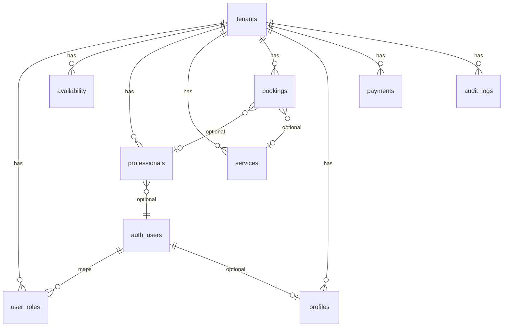

# Documentação técnica — Markee Agendamentos (markee-barbearia)

> **Para quê serve este documento:** entregar contexto completo a qualquer desenvolvedor ou IA para corrigir bugs, adicionar features ou operar o sistema **sem precisar explorar o repositório do zero**.  
> **Branch de referência:** alinhada a `origin/main` (GitHub).  
> **Stack:** React 19 + TanStack Start/Router + Supabase (Postgres, Auth, Storage) + Tailwind v4 + deploy Cloudflare.

---

## 1. Visão geral do produto

O sistema tem **três superfícies** distintas:

| Superfície | URL base | Quem usa | Objetivo |
|------------|----------|----------|----------|
| **App público + painel do estabelecimento** | `/b/:slug/...` e rotas legadas (`/`, `/agendar`) | Cliente final e dono/profissional | Agendar serviços, gerenciar agenda |
| **BackOffice Markee (Admin)** | `/admin/...` | Você e sócio (role `admin`) | Criar empresas, cobrar assinatura, bloquear inadimplentes |
| **Auth Supabase** | — | Todos | Login email/senha |

**Multi-tenant:** cada estabelecimento é um registro em `public.tenants` identificado por `slug` (ex.: `dom-amorim`, `studio-nails`). Quase todas as tabelas de negócio têm `tenant_id`.

---

## 2. Como rodar localmente

```bash
npm install
npm run dev          # Vite dev server (porta padrão 5173)
npm run build        # Build produção
```

**Variáveis obrigatórias** (`.env` ou painel Lovable/Supabase):

- `VITE_SUPABASE_URL` (ou `SUPABASE_URL` no SSR)
- `VITE_SUPABASE_PUBLISHABLE_KEY` (anon key)

**Server-side** (server functions / admin):

- `SUPABASE_SERVICE_ROLE_KEY` — em `src/integrations/supabase/client.server.ts`

Tipos do banco: `src/integrations/supabase/types.ts` (gerar com `supabase gen types` após migrations).

**Migrations:** pasta `supabase/migrations/` — ordem cronológica no nome do arquivo.

---

## 3. Mapa de rotas (frontend)

Geradas por **TanStack Router** (file-based em `src/routes/`). Árvore resumida em `src/routeTree.gen.ts` (não editar manualmente).

### 3.1 Público / cliente (usa `AppShell` + `TenantThemeProvider`)

| Rota | Arquivo | Descrição |
|------|---------|-----------|
| `/` | `src/routes/index.tsx` | Redireciona para `/b/dom-amorim` |
| `/b/:slug/` | `src/routes/b.$slug.index.tsx` → reexporta `Index` | Home do estabelecimento (logo, agendar) |
| `/b/:slug/agendar` | `src/routes/b.$slug.agendar.tsx` | Fluxo de agendamento |
| `/b/:slug/meus-agendamentos` | `src/routes/b.$slug.meus-agendamentos.tsx` | Consulta por WhatsApp |
| `/b/:slug/agendamento-confirmado` | `src/routes/b.$slug.agendamento-confirmado.tsx` | Confirmação |
| `/b/:slug/login` | `src/routes/b.$slug.login.tsx` | Login dono/profissional **daquele slug** |
| `/b/:slug/painel` | `src/routes/b.$slug.painel.tsx` | Valida tenant + redireciona para `/painel` |

Rotas legadas (compat): `/agendar`, `/login`, `/meus-agendamentos` — redirecionam ou usam tenant default.

### 3.2 Painel do estabelecimento (autenticado, `AppShell`)

| Rota | Arquivo |
|------|---------|
| `/painel` | `src/routes/painel.index.tsx` — agenda |
| `/painel/clientes` | `src/routes/painel.clientes.tsx` |
| `/painel/servicos` | `src/routes/painel.servicos.tsx` (+ `novo`, `$id`) |
| `/painel/disponibilidade` | `src/routes/painel.disponibilidade.index.tsx` |
| `/painel/disponibilidade/mais-ajustes` | `src/routes/painel.disponibilidade.mais-ajustes.tsx` — logo, profissionais |
| `/painel/avaliacoes` | `src/routes/painel.avaliacoes.tsx` |
| `/painel/recorrencia` | `src/routes/painel.recorrencia.tsx` |
| `/painel/pagamentos` | `src/routes/painel.pagamentos.tsx` — **existe mas não está no menu lateral** |

Layout: `src/routes/painel.tsx` — menu hamburger (Agenda, Clientes, Serviços, Disponib., Avaliações, Recorrência).

### 3.3 BackOffice Markee (`AdminShell`, **não** usa `AppShell`)

| Rota | Arquivo |
|------|---------|
| `/admin/login` | `src/routes/admin.login.tsx` |
| `/admin` | `src/routes/admin.index.tsx` — dashboard KPIs |
| `/admin/empresas` | `src/routes/admin.empresas.index.tsx` |
| `/admin/empresas/nova` | `src/routes/admin.empresas.nova.tsx` |
| `/admin/empresas/:id` | `src/routes/admin.empresas.$id.tsx` — editar, pagamento, bloqueio |
| `/admin/pagamentos` | `src/routes/admin.pagamentos.tsx` |
| `/admin/auditoria` | `src/routes/admin.auditoria.tsx` |

Guard: `src/routes/admin.tsx` — sessão + RPC `is_admin`.

Menu lateral: `src/components/AdminShell.tsx` (const `NAV`).

---

## 4. Arquitetura de código (onde mexer)

```
src/
├── routes/              # Uma página = um arquivo (TanStack Router)
├── components/          # UI reutilizável (AppShell, AdminShell, ServiceForm…)
├── lib/
│   ├── store.ts         # Agendamento, availability, bookings, RPCs cliente
│   ├── tenant.ts        # Slug, cores, localStorage, tenantHref()
│   ├── admin.functions.ts  # Server functions do BackOffice (createServerFn)
│   └── professionals.functions.ts  # CRUD profissionais (service role)
├── hooks/
│   ├── use-auth.ts
│   └── use-tenant-status.ts  # Bloqueio por inadimplência
├── integrations/supabase/
│   ├── client.ts        # Browser (anon key)
│   ├── client.server.ts # SERVICE_ROLE no servidor
│   ├── types.ts         # Tipos gerados do Postgres
│   └── auth-middleware.ts
├── styles.css           # Tema global + classes .glass, .btn-primary
└── routeTree.gen.ts     # AUTO-GERADO
```

**Raiz visual global:** `src/routes/__root.tsx` envolve tudo com `TenantThemeProvider` + `Toaster`.

**Tenant / cores:** `src/components/TenantThemeProvider.tsx` injeta CSS variables `--primary`, `--primary-glow` a partir de `getCurrentTenant()` em `src/lib/tenant.ts`.

**Bloqueio financeiro:** `src/components/AppShell.tsx` chama `useTenantStatus()` → se `effective_status === 'blocked'`, mostra `TenantBlockedScreen` (overlay full screen).

---

## 5. Multi-tenant — como funciona

### 5.1 Identificação do tenant

1. **URL:** `/b/:slug/...` → `resolveTenantSlugFromPath()` em `src/lib/tenant.ts`
2. **localStorage:** `rh_tenant_slug`, `rh_tenant_id` — setados no login (`setCurrentTenantContext`)
3. **Fallback:** `DEFAULT_TENANT_SLUG = "dom-amorim"`

### 5.2 Mapa estático de branding (código)

`src/lib/tenant.ts` → objeto `TENANTS` com cores hardcoded para slugs conhecidos. Comentário no arquivo explica: para nova empresa também pode-se usar cores do **banco** (`tenants.primary_color`, etc.) via `mapTenantRecordToBrand()`.

### 5.3 Queries no frontend

Padrão universal:

```ts
import { getCurrentTenantId } from "@/lib/tenant";

const tenantId = getCurrentTenantId();
await supabase.from("services").select("*").eq("tenant_id", tenantId);
```

`src/lib/store.ts` — `fetchAvailability()`, `createBooking()`, etc. já filtram por `getCurrentTenantId()`.

### 5.4 Links que respeitam o slug

```ts
import { tenantHref } from "@/lib/tenant";
// Em /b/studio-nails/agendar → tenantHref("/painel") === "/b/studio-nails/painel" (na prática redireciona para /painel após setar context)
```

---

## 6. Banco de dados (Supabase Postgres)

### 6.1 Diagrama lógico



### 6.2 Tabela central: `tenants`

| Coluna | Uso |
|--------|-----|
| `id` | UUID (Dom Amorim fixo: `00000000-0000-0000-0000-000000000001`) |
| `slug` | URL `/b/:slug` — único, só `a-z0-9-` |
| `name` | Nome exibido |
| `active` | Flag legada |
| `plan` | Ex.: `basic` |
| `status` | `active` \| `late` \| `blocked` (cobrança) |
| `due_date` | Próximo vencimento assinatura |
| `last_payment_at` | Último pagamento registrado |
| `monthly_price` | Valor mensal (R$) |
| `owner_name`, `owner_email`, `owner_phone` | Dados do dono |
| `blocked_grace_days` | Dias após vencimento até bloquear (default 7) |
| `primary_color`, `primary_glow_color`, `secondary_color` | Branding (opcional no DB) |

Migration base: `supabase/migrations/20260520230724_*.sql`  
Pagamentos/admin: `supabase/migrations/20260522231140_*.sql`

### 6.3 Tabelas de negócio (todas com `tenant_id`)

| Tabela | Função |
|--------|--------|
| `availability` | 1 linha por tenant: horários, logo_url, business_name, redes |
| `professionals` | Barbeiros/funcionários |
| `services` | Serviços + promo |
| `bookings` | Agendamentos |
| `profiles` | Clientes (whatsapp único **por tenant**) |
| `blocked_dates` | Dias fechados |
| `reviews` | Avaliações |
| `recurrence_campaigns` | Campanhas WhatsApp (estrutura) |
| `user_roles` | Vínculo user ↔ tenant ↔ role |

### 6.4 Tabelas plataforma Markee

| Tabela | Função |
|--------|--------|
| `payments` | Pagamentos confirmados pelo admin |
| `audit_logs` | Auditoria (criação empresa, pagamento, bloqueio) |

### 6.5 Enum `app_role`

`owner` | `professional` | `client` | `admin`

- **`admin`:** só Markee — acesso `/admin`, RPC `is_admin()`
- **`owner`:** dono do estabelecimento — painel, CRUD via server functions
- **`professional`:** acesso painel (policies antigas)
- **`client`:** perfil de cliente

### 6.6 Funções RPC importantes

| Função | Quem chama | O que faz |
|--------|------------|-----------|
| `is_admin(user_id)` | `/admin` guard | Boolean |
| `user_belongs_to_tenant(user, tenant)` | `tenantSubscription` | Boolean |
| `tenant_effective_status(tenant_id)` | Bloqueio | `active`/`late`/`blocked` |
| `tenant_public_status(tenant_id)` | `useTenantStatus` | Status + dados para tela bloqueio |
| `refresh_all_tenant_statuses()` | Dashboard admin | Atualiza `tenants.status` em massa |
| `confirm_payment(tenant, amount, ...)` | Admin confirma PIX | Insere `payments`, estende `due_date` +30d, `status=active` |
| `get_taken_slots(date, pro?, tenant_id?)` | Agendamento | Horários ocupados |
| `ensure_client_profile(...)` | Agendamento | Upsert cliente |
| `get_bookings_by_whatsapp(...)` | Meus agendamentos | |
| `cancel_booking(...)` | Cancelamento | |
| `is_client_active(whatsapp, tenant_id?)` | Home/agendar | Cliente bloqueado? |

### 6.7 RLS (resumo)

- Dados públicos de leitura: policies permissivas + filtros por `tenant_id` no app.
- **Admin:** policies `admin manages *` usando `is_admin(auth.uid())`.
- **Owner:** leitura/escrita no próprio tenant via `user_belongs_to_tenant` / `has_role`.
- Server functions sensíveis usam **`supabaseAdmin`** (service role) após validar admin/owner no handler.

---

## 7. Autenticação e usuários

### 7.1 Login estabelecimento

**Arquivo:** `src/routes/login.tsx` (componente `LoginPage` exportado; usado em `b.$slug.login.tsx`).

Fluxo:

1. `supabase.auth.signInWithPassword`
2. Busca `user_roles` + join `tenants` pelo `user_id`
3. Valida que existe role para o **slug da URL**
4. `setCurrentTenantContext(slug, tenantId)`
5. Redirect `window.location.href = /b/${slug}/painel` → rota `b.$slug.painel` → `/painel`

### 7.2 Login BackOffice

**Arquivo:** `src/routes/admin.login.tsx`

Após login, RPC `is_admin`. Sem tenant.

### 7.3 Criar usuário admin Markee (SQL manual)

```sql
-- 1) Criar user no Supabase Auth (Dashboard → Authentication → Users) ou já existir
-- 2) Vincular role admin (tenant_id pode ser o default ou qualquer — is_admin ignora tenant)
INSERT INTO public.user_roles (user_id, role, tenant_id)
VALUES (
  '<UUID_DO_AUTH_USER>',
  'admin',
  '00000000-0000-0000-0000-000000000001'
);
```

### 7.4 Criar dono de empresa (fluxo recomendado)

**UI:** `/admin/empresas/nova` → server function `adminCreateTenant` em `src/lib/admin.functions.ts`.

Faz automaticamente:

- Insert `tenants`
- Insert `availability` vazia
- Cria user Auth (email/senha do formulário)
- Insert `profiles` + `user_roles` (role `owner`)
- Audit log

Retorna URL: `/b/{slug}/login`.

### 7.5 Resetar senha do dono

**UI:** `/admin/empresas/:id` → `adminResetTenantOwnerPassword`.

---

## 8. BackOffice — guia prático

### Onde está no código?

| Peça | Caminho |
|------|---------|
| Layout + menu | `src/components/AdminShell.tsx` |
| Guard sessão admin | `src/routes/admin.tsx` |
| Regras de negócio servidor | `src/lib/admin.functions.ts` |
| Páginas | `src/routes/admin.*.tsx` |

### Como alterar o menu admin?

Editar array `NAV` em `src/components/AdminShell.tsx`.

### Como inserir nova empresa?

1. **Pela UI:** `/admin/empresas/nova`
2. **Opcional código:** adicionar entrada em `TENANTS` em `src/lib/tenant.ts` para cores default offline
3. **SQL** (se manual): insert `tenants` + `availability` + criar auth user + `user_roles`

### Como mudar CSS / cores de uma empresa?

**Opção A — Banco (persistente, recomendado para SaaS):**

- Colunas `tenants.primary_color`, `primary_glow_color`, `secondary_color`
- Garantir que a home/painel carregue tenant do DB e chame `mapTenantRecordToBrand()` (hoje `TenantThemeProvider` usa só `getCurrentTenant()` do mapa estático — **melhoria comum:** ler cores do DB no mount da rota `/b/:slug`)

**Opção B — Mapa estático:**

- Editar `TENANTS["meu-slug"]` em `src/lib/tenant.ts`

**Opção C — CSS global:**

- `src/styles.css` — variáveis `:root` (afeta default antes do TenantThemeProvider)

**Logo do estabelecimento:**

- Coluna `availability.logo_url` (storage público)
- Upload: `src/routes/painel.disponibilidade.mais-ajustes.tsx`
- Exibição home: `src/routes/index.tsx` (modal/lightbox logo)

### Como manter empresa ativa (pagamento Markee)?

1. Admin em `/admin/empresas/:id` confirma pagamento → RPC `confirm_payment`
2. Ou `/admin/pagamentos` lista histórico
3. Isso atualiza `due_date`, `last_payment_at`, `status = active`
4. `refresh_all_tenant_statuses` recalcula `late`/`blocked` por data

**Bloqueio:** se `CURRENT_DATE > due_date + grace_days` → status efetivo `blocked` → `AppShell` bloqueia uso.

---

## 9. Pagamentos e PIX (estado atual)

### Dono do estabelecimento (`/painel/pagamentos`)

- **Arquivo:** `src/routes/painel.pagamentos.tsx`
- **Dados:** `tenantSubscription` em `admin.functions.ts`
- Mostra: status, valor mensal, vencimento, histórico
- **PIX:** placeholder (ícone `QrCode`) — texto “será gerado em breve”

### Admin (`/admin/pagamentos`)

- Lista todos `payments` com nome do tenant
- Confirmação de pagamento principalmente em **detalhe da empresa** (`admin.empresas.$id`)

### Como implementar “menu Pagamento + PIX real” (roteiro para IA)

1. **Menu painel:** em `src/routes/painel.tsx`, adicionar `Link` para `/painel/pagamentos` (rota já existe).
2. **Dados PIX:** novas colunas em `tenants` ex.: `pix_key`, `pix_qr_payload` ou tabela `tenant_billing_settings`.
3. **Admin:** formulário em `admin.empresas.$id` para Markee cadastrar chave PIX recebedora (ou por tenant se cada um paga para Markee central).
4. **QR Code:** lib `qrcode` no frontend gerando imagem a partir do payload EMV PIX, ou URL de imagem no Storage.
5. **Webhook pagamento automático:** futuro — hoje é `confirm_payment` manual.

---

## 10. Fluxo de agendamento (cliente)

**Arquivo principal:** `src/routes/agendar.tsx`

Etapas: `dados` → (`profissional` se `availability.require_pro_selection`) → `servico` → `data` → `horario`.

**Lógica servidor:** `src/lib/store.ts` — `createBooking`, `getAvailableSlots`, RPCs com `getCurrentTenantId()`.

**Realtime:** canais Supabase em `bookings` / `services` / `professionals` para atualizar horários.

---

## 11. Profissionais (painel)

| Ação | Onde |
|------|------|
| UI lista/form | `src/routes/painel.disponibilidade.mais-ajustes.tsx` |
| Server CRUD | `src/lib/professionals.functions.ts` |

Create: cria auth user + `user_roles` (professional) + linha `professionals` com `tenant_id`.

**Listagem:** `.eq("tenant_id", getCurrentTenantId())` no painel; agendar usa `fetchProfessionalsForScope` ou query equivalente em `store`/agendar.

---

## 12. Storage (Supabase)

Bucket **`service-photos`** (público):

- Fotos de serviços, logo (`availability.logo_url`), fotos profissionais
- Paths costumam usar prefixo `{tenant_id}/...`

Upload exemplo: `src/components/ServiceForm.tsx`, painel mais-ajustes.

---

## 13. Cookbook — tarefas comuns para IA

### 13.1 Botão “mostrar senha” no login

**Arquivos:**

- `src/routes/login.tsx` — componente `Field` (linha ~105), input `type="password"`
- Opcional: `src/routes/admin.login.tsx` — mesmo padrão

**Implementação mínima:**

- `useState` `showPassword`
- `type={showPassword ? "text" : "password"}`
- Botão/ícone `Eye` / `EyeOff` (lucide-react) ao lado do campo

Não exige mudança de banco.

### 13.2 Adicionar item no menu do painel

Editar `tabs` e links no Sheet em `src/routes/painel.tsx`.

Criar rota: `src/routes/painel.nome.tsx` → TanStack gera `/painel/nome`.

### 13.3 Nova coluna no banco

1. Nova migration em `supabase/migrations/`
2. `supabase db push` (ambiente dev)
3. Regenerar `src/integrations/supabase/types.ts`
4. Usar coluna no frontend + RLS se necessário

### 13.4 Nova server function (padrão do projeto)

```ts
// src/lib/admin.functions.ts ou novo arquivo *.functions.ts
export const minhaFn = createServerFn({ method: "POST" })
  .middleware([requireSupabaseAuth])
  .inputValidator(...)
  .handler(async ({ context, data }) => {
    await assertAdmin(context); // ou validação owner
    // usar supabaseAdmin para cross-tenant
  });
```

Consumir com `useServerFn(minhaFn)` + React Query na rota.

---

## 14. Migrations — ordem temática

| Arquivo (prefixo data) | Conteúdo |
|----------------------|----------|
| `20260513141620_*` | Schema inicial barbearia (bookings, services, …) |
| `20260520230724_*` | **Multi-tenant:** `tenants`, `tenant_id` em tudo |
| `20260519145033_*` / `20260520233251_*` | Evoluções tenant/branding (verificar no repo) |
| `20260521000526_*` | Ajustes adicionais |
| `20260522231140_*` | **Pagamentos, audit, is_admin, confirm_payment** |
| `20260522231213_*` | Grants RPC |
| `20260522232803_*` | Trigger bloqueio booking se tenant blocked |

Sempre ler o SQL antes de aplicar em produção.

---

## 15. Armadilhas conhecidas (evitar regressão)

1. **Esquecer `tenant_id` em queries** → vazamento de dados entre empresas.
2. **Painel em `/painel` sem passar por `/b/:slug/painel`** → `getCurrentTenantId()` pode estar errado (localStorage).
3. **`professionals.functions` `assertOwner`** — valida qualquer `user_roles.role=owner` sem filtrar tenant; create usa `tenant_id` explícito.
4. **Rota `/painel/pagamentos` existe mas não está no menu** — feature “escondida”.
5. **Cores:** `TenantThemeProvider` usa mapa `TENANTS`; cores no DB só aplicam se o código carregar do Supabase.
6. **Admin não usa `AppShell`** → não sofre bloqueio de tenant (correto).
7. **`routeTree.gen.ts`** — regenerado pelo plugin TanStack Router ao rodar dev/build.

---

## 16. Checklist rápido “onde está X?”

| Pergunta | Resposta |
|----------|----------|
| BackOffice Markee? | `/admin` → `src/routes/admin.*` + `AdminShell` |
| Criar empresa? | `/admin/empresas/nova` + `adminCreateTenant` |
| Login dono? | `/b/:slug/login` |
| Agenda? | `/painel` → `painel.index.tsx` |
| Serviços? | `painel.servicos.*` + `ServiceForm.tsx` |
| Logo? | `painel/disponibilidade/mais-ajustes` + `availability.logo_url` |
| Cores tema? | `tenant.ts` + `TenantThemeProvider.tsx` + `styles.css` |
| Pagamento assinatura? | `payments` + `confirm_payment` + `painel.pagamentos` |
| Bloquear empresa? | `adminSetTenantStatus` ou inadimplência automática |
| Tipos TS do DB? | `src/integrations/supabase/types.ts` |
| Env Supabase? | `VITE_SUPABASE_*` + `SUPABASE_SERVICE_ROLE_KEY` |

---

## 17. Produção vs desenvolvimento

- **Produção atual:** Lovable Cloud / Supabase vinculado no deploy (variáveis no hosting).
- **Não aplicar migrations destrutivas em produção** sem plano; este doc descreve o schema **como está no repositório GitHub (`main`)**.

---

*Documento gerado para onboarding técnico e uso com assistentes de IA. Atualize este arquivo quando mudar rotas, tabelas ou fluxos críticos.*
